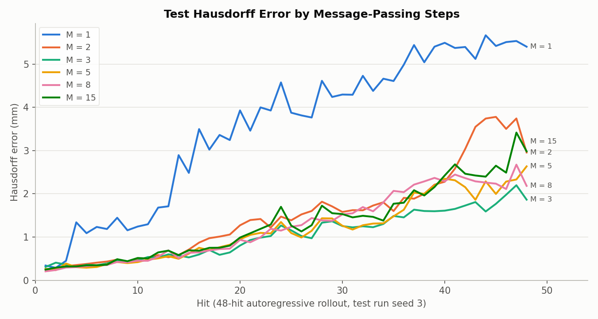
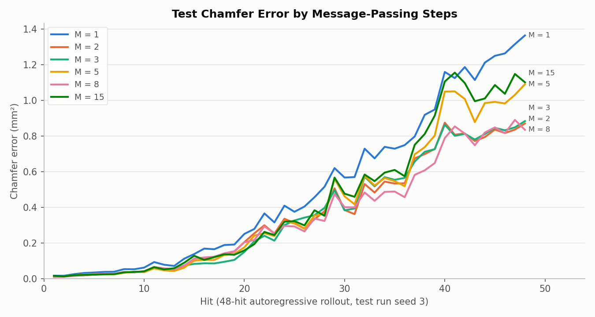
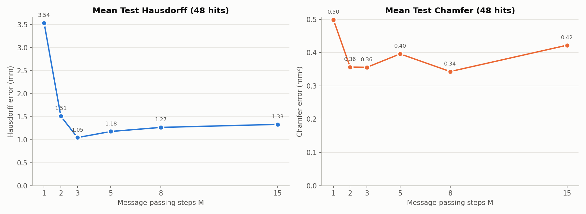
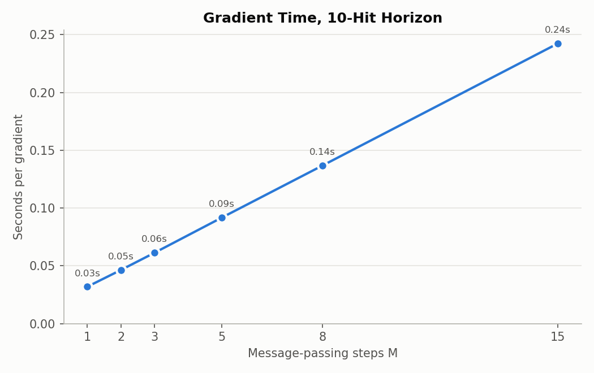

# Message-passing-steps (M) sweep, square-rod regime: results and conclusions

**Date:** 2026-09-26 · **Code:** `GNN/mp_sweep/` (design in its README) ·
**SLURM jobs:** 3885756 (pretrain), 3885757/3885758 (finetune), 3886001 (summary)

## Question

How many message-passing steps M should the GNN's processor use? Each step
lets information travel one mesh edge further, so more steps capture
longer-range effects but make every prediction, and every MPC gradient,
slower. The first sweep (`GNN/old/mp_sweep/`) only tested the short uniform
random-hit rollouts, where every M was equally accurate. This sweep tests
the regime the MPC now works in: 48-hit square-rod forging.

## Setup

- **Message-passing steps:** M = 1, 2, 3, 5, 8, 15.
- **Training, for each M,** the same two stages as the production model:
  1. Pretrain on the uniform random-hit data (383-rollout snapshot).
  2. Finetune on square-rod runs (square + jitter seeds 1, 2, 4-8; 384 hits),
     plus an equal number of uniform hits mixed in each epoch so the model
     doesn't forget them.
- **Held-out runs:** jitter seed 9 decides when finetuning stops; jitter
  seed 3 is used only for the scores below.
- **Metrics:**
  - **Test error:** the finetuned model predicts all 48 hits of seed 3 in a
    row, each prediction feeding the next, starting from the undeformed bar.
    Hausdorff (worst-point distance, mm) and Chamfer (average squared distance,
    mm²) to the true shape, at every hit, at hit 48 and averaged over all 48.
  - **Gradient time:** one forward and backward pass through a 10-hit MPC
    horizon, i.e. the cost of one optimizer iteration. Same L40S GPU and
    inputs for every M; mean of 10 timed runs.

## Results

| M | Parameters | Gradient time, 10-hit horizon (s) | Hit-48 Hausdorff (mm) | Hit-48 Chamfer (mm²) | Mean Hausdorff over 48 hits (mm) | Mean Chamfer over 48 hits (mm²) |
|---|---|---|---|---|---|---|
| 1 | 251k | 0.032 | 5.40 | 1.36 | 3.54 | 0.50 |
| 2 | 400k | 0.046 | 2.96 | 0.87 | 1.51 | 0.36 |
| 3 | 549k | 0.061 | **1.87** | 0.88 | **1.05** | 0.36 |
| 5 | 846k | 0.092 | 2.64 | 1.09 | 1.18 | 0.40 |
| 8 | 1.29M | 0.137 | 2.18 | **0.83** | 1.27 | **0.34** |
| 15 | 2.33M | 0.242 | 2.98 | 1.10 | 1.33 | 0.42 |

Before finetuning, every M was far off by hit 48: 13-18 mm Hausdorff,
12-24 mm² Chamfer. Finetuning cut hit-48 Hausdorff by 2.5× (M = 1) to 9× (M = 3). No model
forgot the uniform data: its one-hit error stayed at 0.296-0.299 NRMSE
throughout.

## Conclusions

1. **One step is clearly not enough.** M = 1's Hausdorff error is about 2-3×
   that of every other M (mean and hit 48), its Chamfer 20-45% higher, and
   its error grows fastest over the rollout.
   Long square-rod rollouts need information to travel further than one mesh
   edge per prediction.
2. **Beyond M = 2-3, more message-passing steps buy nothing.** M = 3 has the lowest Hausdorff
   (mean and hit 48), M = 8 the lowest Chamfer, and M = 15 is no better than
   M = 3 on any metric. Accuracy saturates around 2-3 steps, similar to the
   uniform-data sweep, which saturated by 5.
3. **Cost rises steadily with M.** Gradient time grows roughly linearly,
   from 0.032 s (M = 1) to 0.242 s (M = 15). M = 3 is about 1.5× faster than
   the M = 5 currently used by the MPC, and 4× faster than M = 15.
4. **M = 3 looks like the best trade-off in this sweep:** the lowest
   worst-point error, at two-thirds of M = 5's gradient cost. But see the
   caveats before switching.

## Caveats

- **Each M was trained only once, and scored on one test episode.**
  Every model saw all 8 training episodes, but each M was trained a
  single time from one random initialization (training seed 0), and scored on
  the single 48-hit test episode (seed 3). The per-hit curves
  jump around by 0.5-1 mm between neighbouring hits, so the ordering of
  M = 2, 3, 5, 8, 15 may not survive a rerun. The M = 1 gap is large enough
  to be real.
- **Hausdorff and Chamfer disagree on the order** of M = 2-15 (3 vs. 8 best),
  another sign those differences are small.
- **Less training data than the production model.** The production M = 5
  model trained on 432 square hits (seed 9 included) and scored 2.11 mm
  hit-48 Hausdorff on seed 3, against 2.64 mm for this sweep's M = 5 (384
  hits). The production score is also slightly optimistic, since seed 3
  chose its stopping epoch.
- **Only square-rod shapes were tested.** Other shapes (bulge_head, OSU parts)
  may need a different M.

## Suggested follow-ups

- Retrain M = 2, 3, 5 and 8 with 2-3 more random seeds, to see whether the
  differences hold.
- If M = 3 holds up, retrain the production model at M = 3 on all 432 square
  hits and use it in the MPC. That's about 1.5× faster gradients than now.

## Files

- `figures/` — the four plots above, copied from `GNN/mp_sweep/`.
- `summary.json` — all per-hit and summary numbers, gradient timings,
  parameter counts, best epochs.
