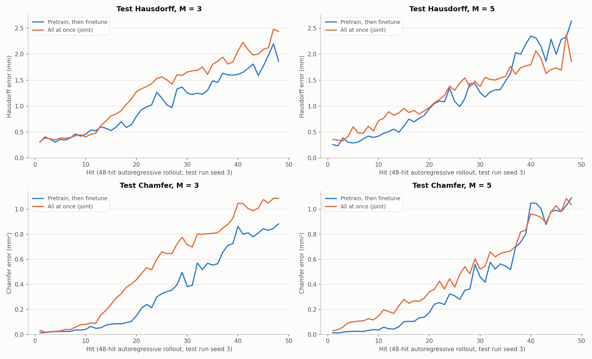

# Pretrain-then-finetune beats training on everything at once

**Date:** 2026-09-26 · **Code:** `GNN/finetune.py` (joint mode: `--from-scratch-mp`) ·
**SLURM jobs:** 3886145 (joint training); the pretrain-then-finetune models come from the
message-passing-steps sweep (3885756-3885758) · **Raw output:** `GNN/joint_training/mp_{3,5}/`,
`GNN/mp_sweep/finetune/mp_{3,5}/`

## Summary

Two ways of training the GNN on both the uniform random-hit data and the
square-rod data were compared:
- **A:** train on the uniform data first, then finetune on the square-rod data.
- **B:** train once, from scratch, on all of it together.

Both used the same data splits and the same held-out square test run, at
M = 3 and M = 5 message-passing steps.

A is better on nearly every measure. On the test run's 48-hit prediction,
A had the lower error at 35-48 of the 48 hits, depending on metric and M.
A's mean Hausdorff and mean Chamfer over all 48 hits are lower at both M. The
gap is largest early in the rollout, where A's Chamfer error is less than half
of B's. A also stays slightly more accurate on the uniform test data.

The one exception is the very end of the M = 5 rollout: B's Hausdorff error is
lower on 11 of the last 12 hits, so B wins hit-48 Hausdorff at M = 5 (1.86 vs.
2.64 mm). A's advantage holds everywhere else, so pretrain-then-finetune stays
the recommended approach. It's also the cheaper way to add future data: a
finetune takes 10-20 minutes.

## What was run

- **Data, identical for both:**
  - uniform random-hit training hits: 1,530, from the pinned 383-rollout snapshot
  - square-rod training episodes: the original square run plus jitter seeds 1, 2, 4-8 (384 hits)
  - early stopping on jitter seed 9; testing on jitter seed 3 (48 hits), which
    neither approach saw during training
- **A, pretrain then finetune** (from the message-passing-steps sweep):
  1. train from random weights on the uniform data (lr 1e-4)
  2. finetune on the 384 square hits plus 384 freshly drawn uniform hits each
     epoch, lr 1e-5, with the input/output scaling frozen at its pretrained values
- **B, all at once:** train from random weights on all 1,530 uniform hits plus
  all 384 square hits every epoch, lr 1e-4, scaling learned from the combined
  data (`GNN/finetune.py --from-scratch-mp M --lr 1e-4 --replay-ratio -1`).
- **Both:** latent size 128, 2 layers per MLP, batch 4, weight decay 1e-4,
  patience 20, training seed 0.
- **Metrics** on seed 3. The model predicts all 48 hits in a row from the
  undeformed bar, each prediction feeding the next:
  - **Hausdorff:** the largest distance between the predicted and true surfaces (mm)
  - **Chamfer:** the average squared distance between them (mm²)
  - reported at hit 48, and averaged over all 48 hits

## Results

| M | Approach | Hit-48 Hausdorff (mm) | Hit-48 Chamfer (mm²) | Mean Hausdorff, 48 hits (mm) | Mean Chamfer, 48 hits (mm²) | Uniform test NRMSE | Training time |
|---|---|---|---|---|---|---|---|
| 3 | A: pretrain, then finetune | **1.87** | **0.88** | **1.05** | **0.36** | **0.297** | 13 + 9 min |
| 3 | B: all at once | 2.44 | 1.09 | 1.31 | 0.54 | 0.304 | 13 min |
| 5 | A: pretrain, then finetune | 2.64 | 1.09 | **1.18** | **0.40** | **0.298** | 12 + 17 min |
| 5 | B: all at once | **1.86** | **1.04** | 1.22 | 0.48 | 0.308 | 15 min |

"Uniform test NRMSE" is the one-hit prediction error on the 77-rollout uniform
test set, divided by the spread of the true displacements. Lower is better, and
1.0 means no better than predicting the average. A's time is pretraining plus
finetuning.

How often each approach had the lower error, hit by hit:

| M | Metric | A lower | Mean, hits 1-24 (A vs. B) |
|---|---|---|---|
| 3 | Hausdorff | 43 of 48 hits | 0.59 vs. 0.74 mm |
| 3 | Chamfer | 48 of 48 hits | 0.085 vs. 0.215 mm² |
| 5 | Hausdorff | 35 of 48 hits (34 of the first 36; 1 of the last 12) | 0.61 vs. 0.77 mm |
| 5 | Chamfer | 43 of 48 hits (all of the first 36) | 0.094 vs. 0.207 mm² |

At M = 3, A's error sits below B's almost the whole way, for both metrics. At
M = 5, A is clearly lower until about hit 35. After that the curves meet, and
B's Hausdorff is lower over the last dozen hits.

## Why A is likely ahead

These are plausible explanations, not tested ones:

- **The square data counts for more in A.** During finetuning, square hits are
  half of every epoch. In B they're about a fifth (384 of 1,914), so B spends
  most of its effort on the uniform data.
- **A starts from a model that already knows the physics.** Finetuning refines
  it gently (lr 1e-5) toward the heavily deformed square regime. B has to learn
  everything at once from random weights, and its early stopping picked much
  earlier epochs (43 at M = 3, 27 at M = 5, vs. 78 and 114 for A's finetunes),
  after which the square validation error stopped improving.

## Conclusions

1. **Pretrain-then-finetune is the better way to train this GNN.** It's more
   accurate over the rollout at both M, on both metrics, and on the uniform
   test data.
2. **The advantage is largest early in the rollout.** Over the first 24 hits,
   A's Chamfer error is less than half of B's at both M.
3. **Hit-48 alone would give a misleading picture at M = 5,** where B wins on
   Hausdorff. The per-hit counts and means are the more reliable comparison;
   a single final hit is noisy.
4. **A is also more practical.** New data, such as tomorrow's branch runs, can
   be added with a 10-20 minute finetune of the existing pretrained model,
   without retraining from scratch.

## Caveats

- **Each approach was trained once per M,** from one random initialization, and
  scored on one test episode. The M = 3 result (A ahead on 43-48 of 48 hits) is
  strong; the M = 5 late-rollout reversal could be run-to-run variation.
- **B wasn't rebalanced.** Oversampling the square data in B, to match A's 50/50
  finetuning mix, might narrow the gap. This compared the two approaches as
  literally stated: "finetune on square" vs. "train on everything together".
- **Different learning rates** (1e-5 finetune vs. 1e-4 from scratch) are part
  of each approach, not tuned separately.

## Possible next steps

- Rerun both approaches with 2-3 more random seeds at M = 3 and M = 5, together
  with the message-passing-steps repeats already suggested.
- If a single-stage pipeline is ever preferred, try B with the square data
  oversampled to half of each epoch.

## Files

- `figures/per_hit_pretrain_vs_joint.png` — made by `make_comparison_figure.py`
  in this folder, from both runs' `metrics.json`.
- Joint-training runs: `GNN/joint_training/mp_{3,5}/` (checkpoint,
  `metrics.json`, seed-3 eval dumps, training curves; git-ignored).
- Pretrain-then-finetune runs: `GNN/mp_sweep/finetune/mp_{3,5}/` and their
  pretraining in `GNN/mp_sweep/pretrain/mp_{3,5}/`.
