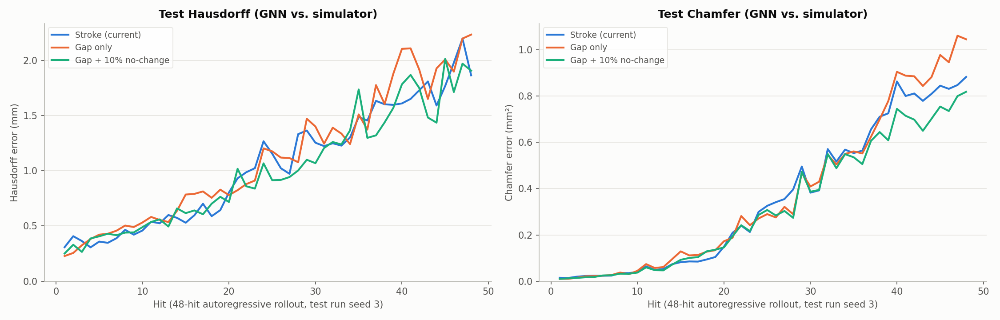
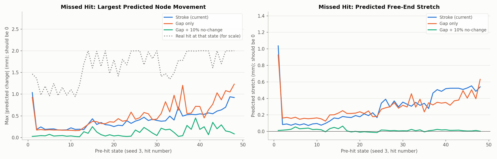
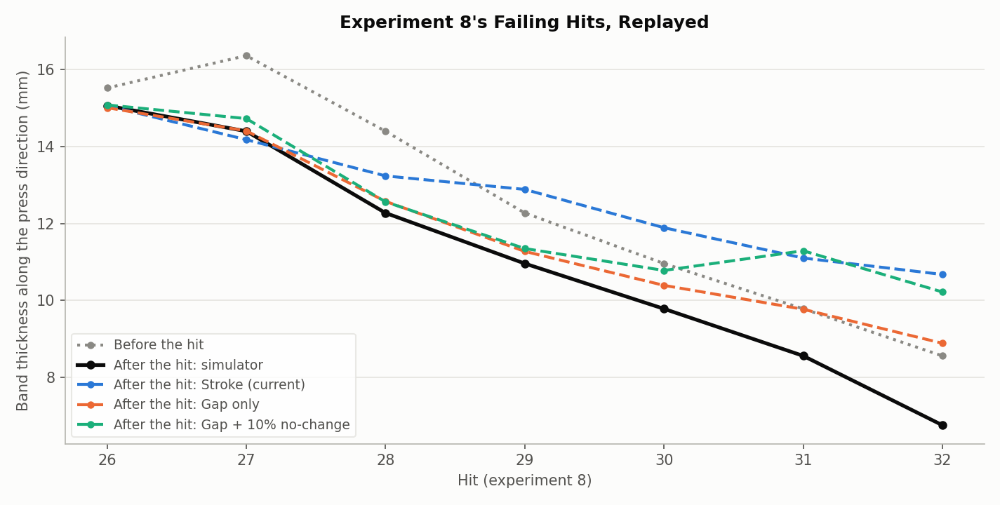

# Absolute gap control: as accurate as the stroke model, and with no-change examples it stops predicting stretch from missed hits

**Date:** 2026-09-27 · **Code:** `GNN/data.py` (`--control gap`, `--no-change-frac`),
`GNN/train.py`, `GNN/finetune.py` · **SLURM job:** 3890897 (array: 0 = gap only,
1 = gap + no-change) · **Raw output:** `GNN/gap_control/{gap_only,gap_nochange10}/`

## Summary

Experiments 7 and 8 failed on hits the GNN mispredicts. Two things were
changed to fix this.
- **The control input:** the GNN's 4th control used to be the relative stroke
  (each die starts at the bar's outermost point in its band and moves in by
  u). It is now the absolute **half-gap**: half the final distance between
  the dies, centred on the bar.
- **No-change examples:** 10% of each training epoch is now synthetic
  "no-change" hits, where the gap is wider than the bar and nothing moves.

Three M = 3 models were compared. All were trained the same way: pretrained
on the random-hit data, then finetuned on the square runs, with seed 9 for
early stopping and seed 3 held out for testing.

**On the normal held-out test, all three are about equally accurate.** The
gap + no-change model has the lowest mean error over the 48-hit test rollout
(Hausdorff 1.01 mm, Chamfer 0.326 mm², vs. 1.05 / 0.356 for the stroke
model). The gap-only model is a little worse late in the rollout.

**On missed hits, only the no-change examples help.** When the dies don't
touch the bar, the stroke model still predicts the free end stretches 0.30 mm
on average, and the gap-only model 0.29 mm. The gap + no-change model predicts
0.015 mm. This drift is what made idling look productive in experiment 7.

**On experiment 8's failing hits, the gap input helps.** Replayed from the
simulator's true states, both gap models predict the thinning of hits 28-30
much better than the stroke model, which predicted thickening from
hit 29 on. On the most-flattened states (hits 31-32, gaps at or below the edge of the
training data) both gap models go wrong again. Experiment 9's lower limit
(4.25 mm) excludes hit 32's gap but not hit 31's. Both gap models also
over-predict stretch on these flattened states (about 1.1 mm predicted vs.
0.3-0.5 mm real on hits 29-31).

The gap + no-change model is experiment 9's planner (job 3891118, running).

## What was run

**How the gap is defined:**
- half_gap = (band half-thickness) − u, where the band half-thickness is half
  the distance between the two outermost lateral-surface nodes in the die
  band, along the press direction. That's the same set of nodes the
  simulator uses to place the dies.
- This describes exactly what the simulator did for every recorded hit, so
  the old data gets new labels without being re-simulated. Checked on the 39
  hits of the square run whose target half-gap was scheduled directly (no
  2 mm cap, no split): the computed and scheduled half-gaps agree to
  0.0000 mm.
- The GNN receives it as a raw fraction over 4-10 mm, like the other controls.

**No-change examples:**
- Each epoch, 10% of the training items are synthetic: a real pre-hit state
  with that hit's station and angle, and a half-gap 0-2 mm wider than the
  bar.
- The target is "no change". Examples are redrawn every epoch, in pretraining
  and finetuning alike.

**Recipe:** identical to the current M = 3 model in `mp_sweep`:
- **Pretraining:** the 383-rollout snapshot, lr 1e-4, patience 20.
- **Finetuning:** the square runs plus an equal number of replayed
  pretraining hits, lr 1e-5, normalizers frozen, early stopping on seed 9,
  testing on seed 3.
- **Seed:** 0 for all.
- **Only differences:** the 4th control, and whether no-change examples are
  used.

**Training time:**
- Gap only: 16 min pretraining + 16 min finetuning.
- Gap + no-change: 17 min + 24 min.
- Finetuning stopped at epoch 149 and 153 respectively (the stroke model
  stopped at 78).

## Results

### Held-out square run (seed 3)

| Model | One-hit NRMSE | 48-hit rollout: Hausdorff at hit 48 (mm) | Chamfer at hit 48 (mm²) | Mean Hausdorff (mm) | Mean Chamfer (mm²) | Random-hit test NRMSE (forgetting check) |
|---|---|---|---|---|---|---|
| Stroke (current) | 0.320 | **1.87** | 0.883 | 1.05 | 0.356 | 0.297 |
| Gap only | 0.312 | 2.23 | 1.046 | 1.12 | 0.376 | 0.302 |
| Gap + 10% no-change | **0.307** | 1.91 | **0.819** | **1.01** | **0.326** | 0.301 |

What the columns mean:
- **One-hit NRMSE:** the error predicting each hit from the true state before
  it, divided by the typical size of a hit's change.
- **Rollout columns:** the GNN predicts all 48 hits in sequence from its own
  previous predictions, compared with the simulator. Hausdorff is the largest
  surface-to-surface distance; Chamfer is the mean squared nearest-surface
  distance.

The three are hard to tell apart for the first ~35 hits. After that, gap
only drifts highest on Chamfer, and gap + no-change is lowest on Chamfer
through the end. Hausdorff is noisy for all three.

### Missed hits (dies don't touch the bar)

These use every true pre-hit state of seed 3 (48 states), with that hit's
station and angle. For the gap models the half-gap is 0.5 mm wider than the
bar. For the stroke model the stroke is 0, the closest it can express. The
correct answer is no change.

| Model | Largest node movement, mean (max) over states (mm) | Free-end stretch, mean (max) (mm) |
|---|---|---|
| Stroke (current) | 0.41 (1.04) | 0.30 (1.04) |
| Gap only | 0.51 (1.23) | 0.29 (0.93) |
| Gap + 10% no-change | **0.12 (0.45)** | **0.015 (0.065)** |

For scale, a real hit's largest node movement averages 1.64 mm.

With no training data for missed hits, both the stroke and gap-only models
predict stretch that grows through the run, reaching 0.5-0.6 mm per missed
hit on the long, thin states near the end. That is the "free stretch" the MPC
exploited in experiment 7. The no-change examples remove it.

### Experiment 8's failing hits, replayed

These are hits 26-32 of experiment 8. Each model predicts the hit actually
applied (converted to its half-gap for the gap models), starting from the
simulator's true state. Band thickness is measured over x = 20-35 mm along the
press direction.

| Hit | Stroke (mm) | Half-gap (mm) | Before (mm) | Simulator (mm) | Stroke model (mm) | Gap only (mm) | Gap + no-change (mm) |
|---|---|---|---|---|---|---|---|
| 26 | 2.00 | 5.71 | 15.52 | 15.07 | 15.07 | 15.01 | 15.09 |
| 27 | 2.00 | 6.18 | 16.37 | 14.40 | 14.18 | 14.41 | 14.73 |
| 28 | 1.16 | 6.14 | 14.40 | 12.28 | 13.24 | 12.58 | 12.57 |
| 29 | 0.66 | 5.48 | 12.28 | 10.96 | 12.89 | 11.28 | 11.35 |
| 30 | 0.59 | 4.89 | 10.96 | 9.78 | 11.89 | 10.39 | 10.78 |
| 31 | 0.61 | 4.28 | 9.78 | 8.56 | 11.10 | 9.77 | 11.29 |
| 32 | 0.90 | 3.38 | 8.56 | 6.76 | 10.68 | 8.89 | 10.22 |

- **Hits 28-30:** both gap models predict the thinning within 0.3-1.0 mm. The
  stroke model predicts thickening on hits 29-30.
- **Hits 31-32:** the half-gaps (4.28 and 3.38 mm) are at the edge of or
  below the smallest in the training data (4.25 mm). The gap + no-change
  model predicts thickening again, and gap only predicts almost no change
  (hit 31) or slight thickening (hit 32). Experiment 9's lower limit
  (4.25 mm) rules out hit 32's gap, but hit 31's is just inside it.
- **Stretch:** both gap models over-predict it on hits 28-31 (0.69-1.19 mm
  vs. 0.24-0.51 mm real), more than the stroke model does (0.53-0.68 mm).
  The GNN has seen no bars this flat, so no version is reliable there.

## Conclusions

1. **The gap input costs no accuracy.** On the standard held-out test the gap
   models match the stroke model (one-hit NRMSE 0.307-0.312 vs. 0.320; mean
   rollout errors within 9%).
2. **The no-change examples, not the gap input, remove the missed-hit
   drift.** Predicted stretch on a missed hit falls from ~0.3 mm to 0.015 mm.
   The gap input is what lets a "miss" be expressed at all.
3. **The gap input fixes the direction of the error on experiment 8's first
   failing hits.** For hits 28-30 it predicts the thinning, where the stroke
   model under-predicted it or predicted thickening. It does not fix states beyond the training data (hits 31-32, or
   stretch on flattened bars).
4. **Gap + no-change is the better planner model** of the two gap versions:
   lowest mean rollout error and no drift. It is what experiment 9 uses.

## Caveats

- **Added after experiment 9:** the missed-hit fix holds only for bars as thick as the training states
  (band half-thickness about 6.8 mm and up). On sections thinned to about 5.7 mm, the gap + no-change model
  still predicts 0.86 mm of stretch for a miss, and the MPC exploited it
  (`control_reports/2026-09-27_cost_e9_gap_control/report.md`). The missed-hit test here used seed 3's
  own states, which never get that thin, so it could not show this.
- One training seed per model and one test run (seed 3). Differences of a few
  percent in the rollout table are within run-to-run noise.
- Seed 9 chose the finetuning epoch and seed 3 reports the score, as before.
- The missed-hit test uses a margin of 0.5 mm, and "no change" is an
  assumption: a real skipped hit would still get the reheat step. The skip in
  experiment 9 doesn't simulate it either, so the two are consistent.
- The experiment 8 replay is 7 hits from one run, mostly on states outside
  the training data. It shows the direction of the error, not a general
  accuracy.

## Possible next steps

- **Watch experiment 9** for repeated same-spot hits and for skipped hits
  (the MPC can now choose to skip).
- Add training data for thin/flattened bars if the MPC keeps finding states
  the GNN has never seen. For example, finetuning on MPC closed-loop states
  (DAgger-style).

## Files

- `figures/rollout_seed3.png`, `figures/no_contact.png`,
  `figures/e8_replay.png` and `summary.json`: all made by `make_figures.py`
  here. Its inputs are the three models' `checkpoint.pt` and `metrics.json`,
  the seed 3 data, and experiment 8's `results.json` and `step_*.vtu`.
