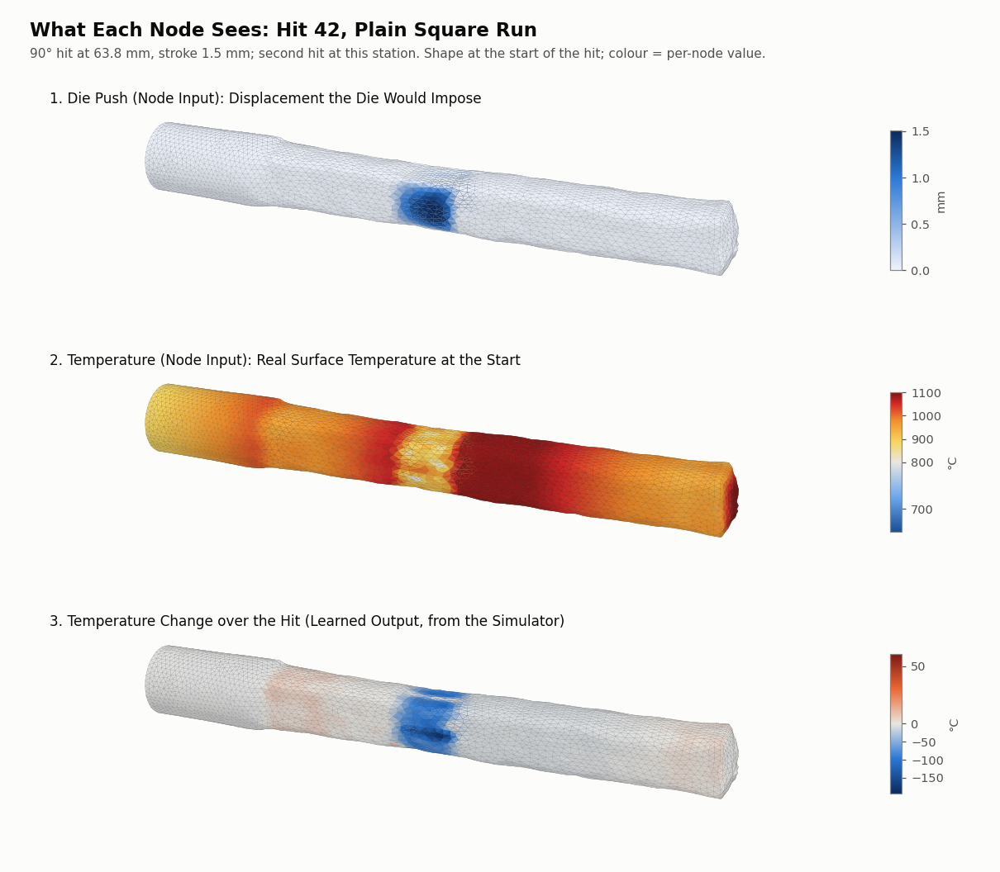

# Coil GNN with temperature in the state: what every node and edge carries, and how it plugs into the MPC

2026-10-07 · design report (no trained results yet) · code: `GNN/coil_T.py` (GNN), `control/mpc_coil.py` (MPC) ·
training sweep in progress: SLURM jobs 3981610 (stages 1–2), 3981611 (stage 3), 3981612 (summary) →
`GNN/coil_T_sweep_test_square/`

## Summary

The surrogate for the new simulator (12.7 mm die fixed in space, coil reheat every 6 hits) is a
MeshGraphNets-style graph neural network (GNN). Its graph is the surface mesh of the billet: 4355 nodes
and 26,118 directed edges, the same for every state because the mesh only moves, never changes. On
2026-10-07 temperature became part of each node's state. The GNN now predicts, per hit, the change of
every surface node's position **and** temperature. Before, temperature was a frozen, bookkept input that
reached ≥ 1090 °C on 96% of the square section by cycle 3 and could not show the die chill.

Each node gets 16 numbers per step: 4 type flags, 8 physical quantities that are normalized (the
displacement the die would impose on it, its distance to the die centre, its displacement, its
temperature), and 4 raw control values (temperature jump at a reheat, sine and cosine of the hit angle,
stroke). Each edge gets 8 numbers: the vector between its two nodes and its length, once in the undeformed
billet and once in the current shape. The network outputs 4 numbers per node: the change of x, y, z
and temperature over the step.

The MPC uses the GNN as a fast, differentiable stand-in for the simulator. Once per cycle (every 6 hits)
it scans the bar, plans the next 6 hits by gradient-based optimization through the GNN, places the coil
at the average planned die centre, reheats, and applies all 6 hits to the simulator. `mpc_coil.py` was
built on 2026-10-04 around the frozen-temperature GNN. The changes for the temperature state were decided
today: the real surface temperature is read at each scan (an IR camera in practice), the reheat rule is
applied to it at the start of the 6-hit forecast, the predicted temperature is carried from hit to hit,
and the cost is unchanged. **These MPC changes are decided but not yet implemented.**

## The graph

| | Count | What it is |
|---|---|---|
| Nodes | 4355 | Every node of the billet's tetrahedral FE mesh that lies on its outer surface (boundary triangles = faces belonging to exactly one tetrahedron) |
| Directed edges | 26,118 | Every edge of those surface triangles, in both directions (13,059 node pairs). Mean node degree 6.0 (min 4, max 9) |
| Edge length in the undeformed billet | 0.61–2.30 mm, mean 1.21 mm | |
| Node types | 4074 lateral-wall nodes; 183 clamp-face nodes (43 of them also lateral wall, at the rim); 1 pin node (on the clamp face); 141 nodes with no flag (the free-end face) | Same node selections as the simulator's boundary conditions |

There are only mesh edges: no extra "world" edges between nodes that come close in space. The bar never
touches itself in the data or the simulator, and the die is an input, not part of the graph. Inner
(volume) nodes are not in the graph, so the GNN sees and predicts the surface only.

## What each node contains (16 inputs)

"Normed" columns are scaled to zero mean and unit spread by an online normalizer that learns its
statistics during stage 1 and is frozen after that. Raw columns are passed through unchanged.

| Col. | Name | Hit step | Reheat step | Units | Scaling |
|---|---|---|---|---|---|
| 0 | is clamp face (x = −5 mm end, fixed axially) | 0/1 | 0/1 | – | raw |
| 1 | is pin node (the one node fixed against rigid motion) | 0/1 | 0/1 | – | raw |
| 2 | is lateral wall (the round outer surface the dies can touch) | 0/1 | 0/1 | – | raw |
| 3 | reheat flag | 0 | 1 | – | raw |
| 4–6 | **die push**: displacement the die would impose on this node (x, y, z) | see below | 0 | mm | normed |
| 7 | distance along the bar from the die centre (current x − centre) | mm | 0 | mm | normed |
| 8–10 | displacement from the undeformed billet (x, y, z) | current | current | mm | normed |
| 11 | **temperature** | at the start of the hit | after the reheat | °C | normed |
| 12 | temperature jump at a reheat ÷ 300 | 0 | (after − before)/300 | – | raw |
| 13 | sin(hit angle) | value | 0 | – | raw |
| 14 | cos(hit angle) | value | 0 | – | raw |
| 15 | stroke fraction (stroke − 0.5)/1.5, so 0.5 mm → 0, 2 mm → 1 | value | 0 | – | raw |

**Die push (columns 4–6).** This tells each node what the die will do to it. For a hit at angle a, the
press direction is e = (0, cos a, −sin a), a rotation about the bar axis (0° presses along y, 90° along z).
Take the lateral-wall nodes currently under the 12.7 mm die footprint. The two dies start at the outermost
of them along e, one on each side, and close in by the stroke. A node that would end up beyond a die's
final position gets the displacement that puts it back on that die plane. Every other node gets zero.
The footprint has a 0.25 mm soft edge (a sigmoid) so the MPC gets a gradient with respect to the die
position. The x component is always zero (its learned spread is 0). For the old band-die data, "under
the die" means the node's undeformed x is inside the band.

**Temperature (column 11).** This is the real surface temperature, which is what an IR camera would read
in practice:

- Hit, new simulator: the simulator's temperature at the start of the hit. In a forecast chain, the GNN's
  own prediction from the previous hit.
- Reheat: the simulator's rule, the hotter of the temperature before and the coil profile (1096 °C over
  a 24.5 mm plateau, falling 5.45 °C/mm outside it). This matches the simulator exactly (0.000 °C on the
  7 reheats checked).
- Old simulator data (stages 1–2): every hit started from the billet's starting profile (676–1096 °C), so
  that profile is the input. The saved temperature after the hit is the target. Those hits change the
  surface temperature by −34 °C on average, and the coldest node of each hit drops by about 380 °C on
  average (under the die).

Learned node scaling (stage-1 checkpoint, M = 1, of the running sweep): temperature mean 933 °C, spread
144 °C. Distance to die centre mean −1.9 mm, spread 37.7 mm. Die push spread 0.15–0.16 mm in y and z.

## What each edge contains (8 inputs)

For an edge from node s to node r, with p the undeformed position and u the current displacement:

| Col. | Name | Units |
|---|---|---|
| 0–2 | p_s − p_r: the edge vector in the undeformed billet | mm |
| 3 | its length | mm |
| 4–6 | (p_s + u_s) − (p_r + u_r): the edge vector in the current shape | mm |
| 7 | its length | mm |

All 8 are normed (learned spreads 0.62–0.85 mm for the vectors, 0.15 mm for the lengths). Together they
tell the network how much each small patch of surface has been stretched and turned, which is how it
"sees" the accumulated deformation. There is no edge temperature; temperature lives on the nodes.

## What the network outputs (4 per node)

| Output | Hit step | Reheat step |
|---|---|---|
| Change of x, y, z displacement (mm) | used: new displacement = old + change | used: the reheat's small shape change (thermal expansion) |
| Change of temperature (°C) | used: new temperature = old + change | **not used**: the temperature comes from the reheat rule |

The outputs are also normalized. Learned spreads: 0.356, 0.221, 0.225 mm for x, y, z and 60.6 °C for
temperature (mean change −33 °C). The training loss is the squared error of the 4 normalized outputs,
summed. So a 60.6 °C temperature error costs as much as a 0.36 mm error in x or a 0.22 mm error in y or z.
This weighting was the default chosen when temperature was added.

The figure shows hit 42 of the plain square run (90°, centre 63.8 mm, stroke 1.5 mm), the second hit at
its station. **Top:** the die push is non-zero on 200 nodes and at most 1.5 mm, the stroke, on the two
sides the dies meet. **Middle:** the temperature input is 721–1107 °C. The band around the station is
visibly cooler, about 850 °C in yellow, because the first hit's dies chilled it, and the zone just reheated
by the coil, toward the free end, is the hottest. **Bottom:** over this hit the simulator changes the
surface temperature by −193 to +60 °C. The chill is concentrated on the faces this hit's dies touched,
and that is what the 4th output has to learn.

## The network

An encode–process–decode MeshGraphNets network, ported from DeepMind's reference:

| Part | What it does | Size |
|---|---|---|
| Node encoder | MLP: 16 inputs → 128 → 128 → 128, ReLU, LayerNorm on the output | latent size 128 |
| Edge encoder | MLP: 8 inputs → 128 → 128 → 128, ReLU, LayerNorm | |
| M message-passing steps | each step, with its own weights: every edge updates from [sender node, receiver node, edge] latents (MLP 384 → 128 → 128 → 128); every node updates from [its latent, sum of its incoming edge latents] (MLP 256 → 128 → 128 → 128); both added back to the previous latents (residual) | M = 1–10 in the sweep |
| Decoder | MLP: 128 → 128 → 128 → 4, no LayerNorm | |

M is the number of message-passing steps. Information spreads about one edge, roughly 1.2 mm, per step,
so M = 5 lets each node "hear" about 6 mm of its neighbourhood directly. Learned parameters:
252,164 for M = 1, 847,108 for M = 5 and 1,590,788 for M = 10.

## How the GNN is trained (three stages, unchanged except for temperature)

| Stage | Data | Examples | Validation (early stopping) |
|---|---|---|---|
| 1 | Old random hits (old band-die simulator) | one hit at a time, from scratch, learning rate 1e-4; normalizers learn here | 20% held-out old random rollouts |
| 2 | Old square runs (seeds 1–8; plain square held out) + an equal number of stage-1 hits each epoch | one hit at a time, learning rate 1e-5 | old square seed 9 |
| 3 | New 5-pass runs (seeds 1–8; plain square held out) + an equal number of old random hits (half under 1 mm stroke) | **whole cycles**: reheat, then up to 6 hits, starting from the true shape and temperature, with every later step fed the GNN's own predicted shape and temperature; learning rate 1e-5 | new seed 9, whole cycles |

Test run: the plain square run, held out of stages 2 and 3. The sweep trains M = 1–10.

## How the GNN plugs into the MPC

### The cycle (built in `control/mpc_coil.py`, 2026-10-04)

| Step | What happens |
|---|---|
| 1. Scan | read the bar's current surface shape from the simulator (a 3D scanner in practice) |
| 2. Stop check | stop if every 2 mm slice of the square section is within 10.6 + 0.2 mm at 0° and 90°, or after 13 cycles |
| 3. Plan | choose 18 numbers, die centre, angle and stroke for each of the 6 hits, by optimizing the cost through the GNN (below) |
| 4. Reheat | coil centred at the average of the 6 planned die centres; the simulator applies its reheat rule |
| 5. Hit | apply all 6 planned hits to the simulator |
| 6. Repeat | back to 1 |

The plan is made before the reheat because the plan sets the coil position. So "queried at the start of
each reheat" and "queried after every 6 hits" are the same single query per cycle.

**The forecast inside the planner** (one GNN call per step, 7 steps per cycle):

1. Reheat step (skipped on cycle 1, a fresh billet): the GNN predicts the reheat's shape change.
2. Hits 1–6: each takes the previous predicted shape (and, with the temperature state, the previous
   predicted temperature) and the hit's 3 controls, and returns the next shape.

**The cost** (unchanged by the temperature decision): for each of the 6 forecast shapes, the sum over all
4355 surface nodes of the squared y and z distance between the node and the same node's position in the
ideal square target; then summed over the 6 shapes. The target (`control/targets/ideal_square_10.6/`)
gives every surface node its own target position: round up to 17.73 mm, a 7.5 mm taper, then a
10.6 × 10.6 mm square to 153.15 mm, with nodes mapped lengthwise by volume conservation. Only y and z
are compared, so the cost is a cross-section penalty and the length is left to volume conservation.

**The optimizer:** SLSQP (scipy), at most 100 iterations, with the 18 controls rescaled to [0, 1]
inside their bounds and the cost divided by its starting value. Bounds:

- die centre from 31.58 mm (the die edge at the start of the square section) to 9.35 mm before the free end;
- angle 0–180°;
- stroke 0.5–2 mm.

The starting guess follows the data runs: the next 3 stations of a sweep, 0° then 90° at each, 1.5 mm.
The gradient of the cost with respect to all 18 controls comes from automatic differentiation through
the 7 GNN steps. The controls enter through the die push, the distance to the die centre and the angle
and stroke columns, and the coil position (the average die centre) enters through the reheat
temperature. For the frozen-temperature GNN with M = 5 one such gradient took 0.072 s
(`GNN/coil_sweep/summary.json`). The temperature-state model has one more output, so it should be
similar, but it hasn't been measured yet.

### What changes with temperature in the state (decided 2026-10-07, not yet implemented)

| | Built version (frozen temperature) | Decided version (temperature in the state) |
|---|---|---|
| Temperature at the scan | none; a bookkept estimate carried from cycle to cycle (hotter of the previous estimate and each coil profile, never cooling) | **measured**: the real surface temperature at the scan (IR camera) |
| Temperature after the reheat, in the forecast | the bookkept estimate | the simulator's rule applied to the measured temperature: hotter of measured and coil profile. Applied at the start of each 6-hit forecast. While planning, a smooth maximum (5 °C softness) and a 0.5 mm smoothed plateau edge keep the gradient with respect to the coil position |
| Temperature during the 6 hits | the same value for all 6 hits | **predicted**: each hit's predicted temperature is the next hit's input, so the die chill is tracked |
| GNN step | shape only | shape and temperature |
| Cost | cross-section, summed over 6 shapes | **unchanged** |
| Simulator solver | iterative (BiCGSTAB), which failed on late reheats | direct sparse solve (`--linear-solver scipy`) |

Because the predicted temperature is now in the forecast, the MPC could also keep hits above the 800 °C
forging limit as a constraint (not a cost term). That isn't decided.

### Still open for the MPC

1. **Keep the 6 hits in the coil zone:** nothing stops the optimizer spreading the hits out, putting some
   on cold metal far from the coil. The data's cycles spread their die centres over 21.5 mm, ±10.7 mm
   around the coil centre.
2. **Angles:** any 0–180° is allowed. The new-simulator data only has hits near 0° and 90° (±5°).
3. **Cycle cap:** 13 cycles is 78 hits. The 4-pass data runs used 76–81 hits and still ended at
   11.8 / 11.2 mm mean widths; the 5-pass runs used about 100.
4. **Stop rule region:** the check starts at the square section's start (25.2 mm). The spot at
   x ≈ 27 mm, next to the taper, stayed at 11–13 mm in every data run, so the rule may never trigger.
5. **Re-plan after the reheat:** optionally re-plan the 6 hits from the scanned post-reheat shape and
   measured temperature, with the coil fixed.
6. **Which GNN:** the M = 5 model of the running sweep is the default candidate; the sweep results will decide.
7. **800 °C limit** as a constraint, now that temperature is predicted.

## Caveats

- **No trained results yet.** The sweep is running. The normalizer values quoted come from the M = 1
  stage-1 checkpoint. Other M values see the same data and should be close, but they aren't identical.
- **The MPC changes are decided but not implemented.** `mpc_coil.py` still uses the bookkept temperature
  and the iterative solver.
- **IR camera idealization:** the simulation gives the exact temperature of every surface node. A real
  camera sees only part of the bar and needs an emissivity correction (scale oxide changes how much the
  surface radiates).
- **Surface only:** the core, which rewarms a chilled skin, is not in the graph. Rewarming must be
  inferred from the surface history.
- **Per-node target:** the cost compares each node with its own target position, using a mapping by
  volume conservation. If the real bar stretches differently, nodes can be compared with a slightly
  wrong slice of the target, though the y–z-only cost limits the effect along most of the square section.

## Possible next steps

1. When the sweep finishes: report the shape and temperature errors per M (figures and GIFs are queued:
   jobs 3981644–3981646) and compare with the frozen-temperature sweep.
2. Implement the decided MPC changes and settle the 7 open items.
3. Run the MPC on the simulator from the undeformed billet, and compare with the scheduled 5-pass runs on
   Hausdorff and Chamfer error to the target and the number of hits.

## Files

| File | What it is |
|---|---|
| `report.md` | this report |
| `figures/node_features_hit42.png` | made by `make_node_features_figure.py` from `data/dataset_die12_coil_5pass/square` (hit 42), using `GNN/coil_T.node_features` exactly as the GNN does |
| `make_node_features_figure.py` | regenerates the figure (run from the repo root) |
| `report.pdf` | this report as a PDF, made by `make_pdf.py` (needs `pip install markdown`) |

Facts come from `GNN/coil_T.py`, `GNN/model.py`, `GNN/data.py`, `GNN/normalizer.py`, `control/mpc_coil.py`,
`control/targets/make_ideal_square_target.py`, the stage-1 checkpoint
`GNN/coil_T_sweep_test_square/mp_1/stage1.pt`, and `GNN/coil_sweep/summary.json`.
