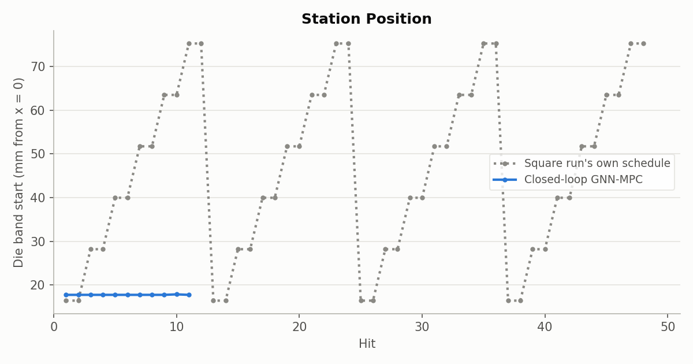
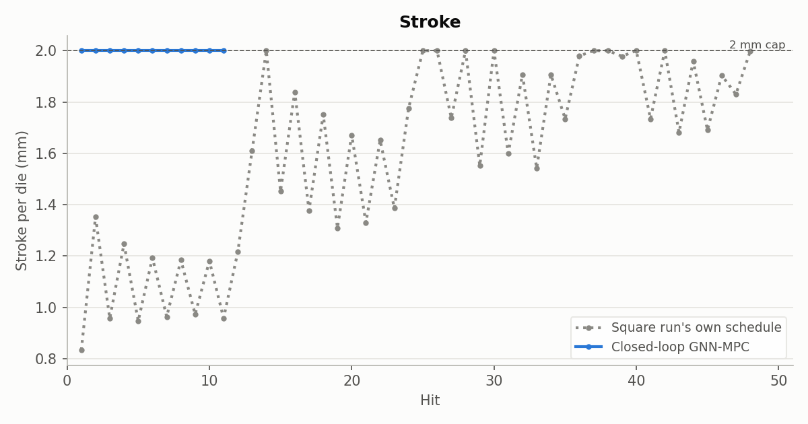
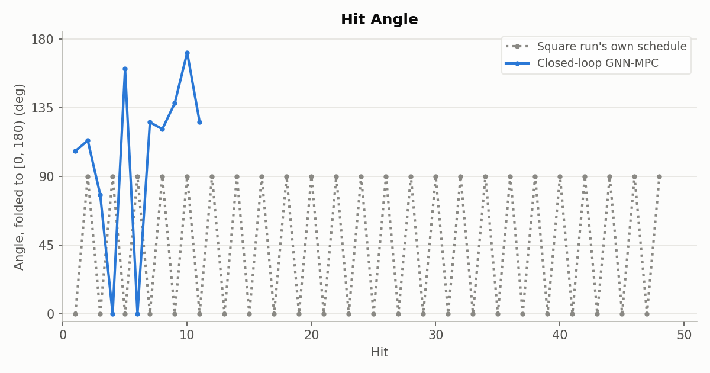
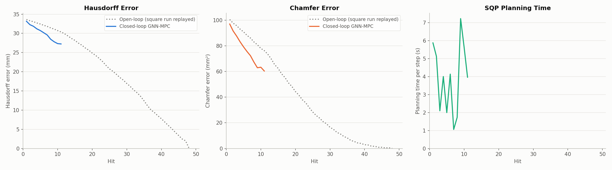
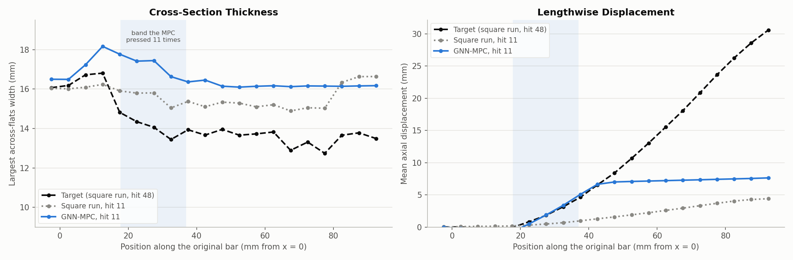

# Cost experiment 0: the original MPC cost pins one station and fails at hit 11

**Date:** 2026-09-26 · **Script:** `control/eval_square_target.py` · **SLURM job:** 3885391 ·
**Raw output:** `control/results/real_simulator/e0_original_cost/`

## Summary

The GNN-MPC was asked to forge the round billet into the square rod produced by
the 48-hit square run. It ran 11 of the planned 50 hits before the simulator
failed. In those 11 hits it pressed the same spot every time, the station
closest to the clamp, at full stroke, changing only the angle.

By the numbers the cost measures, it outperformed the reference: after 11 hits
its Hausdorff error to the target was 27.2 mm vs. 30.4 mm for the square run's
own hit 11. But it wasn't forming a square. The cost is dominated by making
the bar longer, and pressing next to the clamp stretches the bar the most. That
repeated pressing distorted the mesh until the simulator could no longer solve
the reheat before hit 12.

The planner itself worked: plans took 1-7 s and moved well away from their
starting guess. The problem is what it was asked to minimize.

## What was run

- **Target:** the square run's final shape (`data/dataset_finetuning/square`,
  after hit 48): a squared section about 13-14 mm across at its widest along
  most of the bar, about 35 mm longer than the billet. (The square run was
  planned for 10.6 mm, but the 2 mm stroke cap left it short.)
- **Surrogate:** the finetuned 5-step GNN
  (`GNN/finetune_square/checkpoint_mp_5_finetuned_square.pt`).
- **Each step:**
  1. Measure the bar's current surface shape from the simulator.
  2. Plan 10 hits ahead. Each hit has three controls: station position (where
     the 19.3 mm die band starts), angle, and stroke (how far each die moves in).
  3. Predict the shape after each planned hit with the GNN.
  4. Minimize the sum, over the 10 planned hits, of every surface node's
     squared distance from its position in the target.
  5. Apply only the first hit to the simulator, then re-plan.
- **Limits:** station between the 800 °C point (17.7 mm from x = 0) and 75.3 mm;
  angle 0-360°; stroke 0-2 mm (the range the GNN was trained on).
- **Planned length:** exactly 50 hits, always planning 10 ahead.
- **Planner:** SLSQP with exact gradients through the GNN, on controls rescaled
  to 0-1 and a cost normalized to 1 (see "Fixes made before this run").

## What the MPC did

Every hit went to the same station: the lowest one allowed, 17.7 mm, right at
the 800 °C limit. The square run, by contrast, sweeps six stations along the
bar each pass.

Every hit used the maximum 2 mm stroke.

Only the angle varied, with no 0°/90° pattern: 107°, 114°, 78°, 0°, 160°, 0°,
126°, 121°, 138°, 171°, 126° (folded to 0-180°, since the two dies press
opposite sides).

Hausdorff and Chamfer error to the target fell at every hit, faster than the
square run's own trajectory (dotted). Planning took 1.1-7.2 s per step with
5-62 SLSQP iterations.

| Hit | Hausdorff, MPC (mm) | Hausdorff, square run (mm) | Chamfer, MPC (mm²) | Chamfer, square run (mm²) | GNN one-hit error (mm) |
|---|---|---|---|---|---|
| 1 | 33.16 | 33.61 | 97.0 | 100.6 | 0.11 |
| 3 | 31.85 | 33.04 | 87.6 | 95.8 | 0.56 |
| 6 | 30.16 | 32.10 | 75.6 | 88.2 | 0.42 |
| 9 | 27.81 | 31.11 | 63.0 | 80.9 | 0.78 |
| 11 | 27.24 | 30.37 | 60.4 | 76.3 | 0.88 |

"GNN one-hit error" is the RMSE between what the GNN predicted the applied hit
would do and what the simulator actually produced. It grew from 0.11 to about
1 mm as the bar moved into a state the GNN never saw in training (11 hits in a
row at one station).

## Why it did this: the cost rewards stretching, not squaring

The target bar is 35 mm longer than the billet, so nearly every surface node
has to travel a long way along the axis. At the start, **99.3%** of the cost is
lengthwise distance; only 0.7% is cross-section shape. After 11 MPC hits it was
still 95% lengthwise.

- **Right panel, lengthwise displacement:** the MPC reproduced the target's
  stretching exactly up to about 42 mm along the bar. Everything beyond that
  slid along rigidly by about 7 mm. Pressing the band nearest the clamp is the
  quickest way to move the most nodes toward their target positions, so the
  optimizer kept doing it. After 11 hits the MPC's bar had grown 8.0 mm, the
  square run's 4.7 mm.
- **Left panel, cross-section:** the MPC's bar was never squared. Where it
  pressed, the widest extent grew to 16.6-17.8 mm, above the 15.9 mm stock,
  with metal piling up at the band's clamp-side edge (18.2 mm at x ≈ 12 mm).
  Outside the band the bar is untouched. The square run had already brought its
  whole length down to about 15 mm.

Hausdorff and Chamfer measure closeness of the two surfaces, and a bar that's
closer to the right length scores better even with the wrong cross-section. So
the MPC's lower errors don't mean a better part.

## Why the simulator failed

Before hit 12, the reheat step (the temperature reset between hits) failed to
converge. Shrinking the time step 10 times didn't help. This is the same failure
as the square_jitter_seed2 data run, and the cause is the same: badly distorted
elements where the die band keeps pressing.

| | Smallest element volume | Elements below 80% volume | Largest plastic strain |
|---|---|---|---|
| MPC, after hit 11 | 58% | 67 | 747% |
| square_jitter_seed2, at its failure | 67% | 4 | 266% |

The worst elements sit at the band's clamp-side edge (x ≈ 18 mm) and inside the
band (x ≈ 33 mm), exactly where 11 full-stroke hits landed. The simulated die
has a sharp edge and the mesh is never remeshed, so this damage accumulates.

## Fixes made before this run

Both are in `control/mpc.py`, and both affect every earlier MPC result
(details in `control/README.md`):

1. **Stroke mismatch.** The GNN was being told a different stroke than the
   simulator applied, by up to 0.5 mm. Both now receive the same millimetre
   value.
2. **The optimizer wasn't moving.** With a cost around 2 million and controls
   on very different scales (angle 0-360 vs. 0-1), SLSQP returned its starting
   guess and reported success. It now works on rescaled controls and a
   normalized cost. In this run it moved every time.

## What this means

- **The MPC works mechanically.** It plans in seconds, optimizes properly,
  and the GNN tracked the real simulator closely for the first several hits.
- **The node-distance cost is the wrong objective for shape control** when the
  target is much longer than the billet. It turns the problem into "make the
  bar longer", which one clamp-side station does best.
- **The GNN can't be trusted where the MPC went**, since repeated hits at one
  station never appeared in its training data.

## Possible next steps

- **Change the cost** so cross-section shape counts, e.g. compare shapes after
  removing lengthwise displacement, compare cross-sections slice by slice, or
  use Chamfer distance, which doesn't need nodes to match.
- **Discourage repeated hits at one station,** e.g. a penalty for pressing the
  same band repeatedly, or require some coverage of the bar.
- **Keep the plan closer to the training data,** e.g. penalize states or
  controls unlike those the GNN was trained on.
- **Resuming the run as-is** (`sbatch slurm_scripts/submit_mpc_square_target.sh`
  continues from hit 11) would probably just repeat the same behaviour until the
  next failure.

## Files

- `figures/error_vs_hit.png`, `figures/controls_{station,angle,stroke}.png` —
  copied from the run folder (all cover hits 1-11).
- `figures/bar_profile_hit11.png` — made by `make_profile_figure.py` in this
  folder, from the run's `step_11.vtu`, `target.vtu` and the square run's
  `hit_11_final.vtu`.
