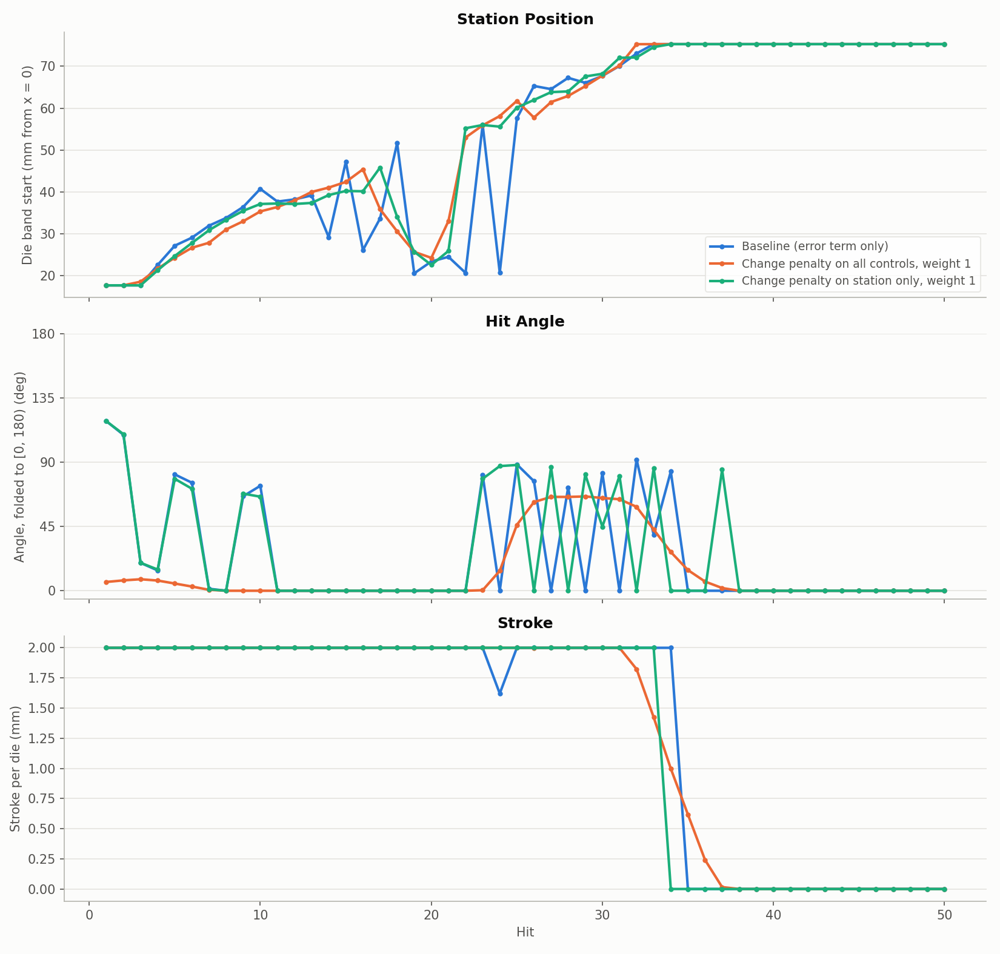
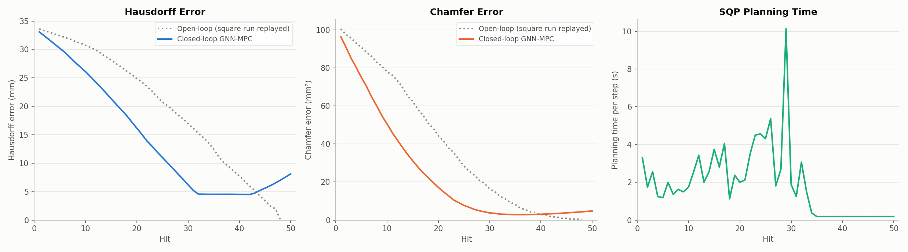
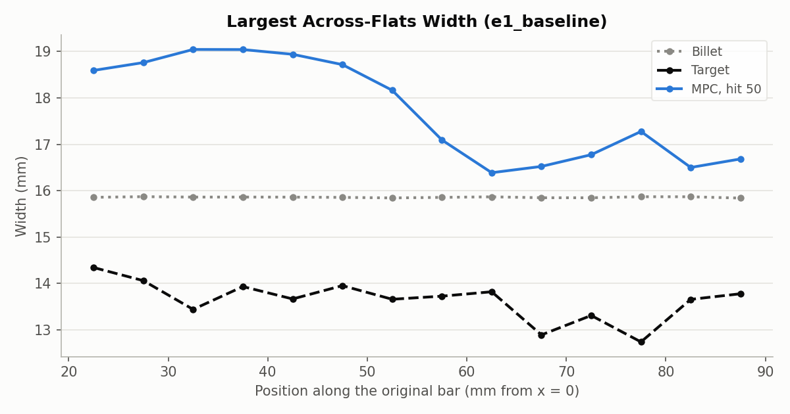

# Cost experiment 1: control-change penalties don't fix the MPC

**Date:** 2026-09-26 · **Script:** `control/cost_design.py` · **SLURM job:** 3886258 (7 configs) ·
**Raw output:** `control/results/surrogate/e1/e1_*/` · **Configs:** `exp1_control_change.json` (this folder)

## Summary

The square-rod MPC stretched the bar instead of squaring it (see
`2026-09-26_cost_e0_original`). This experiment kept the existing error term
(each surface node's squared distance from its target position, summed over
the 10-hit plan) and added penalties on how much the controls change from one
hit to the next. The **controls** are the three things the MPC picks for every
hit: the **station** (where along the bar the 19.3 mm die band starts), the
**angle** (how far the bar is turned before the hit) and the **stroke** (how
far each die moves in). The penalties charged the MPC for choosing a different
station, angle or stroke than the previous hit:
- on all three controls together: ||u_k+1 − u_k||²
- on the station only: |d_k+1 − d_k|²

Each was tried at three weights.

**None of them helped.** Every configuration, including the baseline without
penalties, ended with the same outcomes:
- **No squaring:** the cross-section is no closer to the target than the
  untouched billet's.
- **Too much stretching:** the bar's free end moved about 42 mm, against the
  target's 35 mm.
- **Early stop:** the MPC stopped hitting after hit 33-36.

The penalties were a tiny share of the plan cost (median 0.002-0.17%, never
above 4.3%), so they barely changed the plans. Where they did change something, it went the wrong way: penalizing
angle changes froze the angle near 0°, and squaring needs alternating 0°/90°
hits. The root cause is the error term itself, which is almost entirely about
the bar's length.

## What was run

- **Test bed, a "surrogate closed loop":** the MPC plans with the GNN, and the
  same GNN stands in for the simulator. Each applied hit's result is the GNN's
  prediction. A 50-hit run takes about 2-3 minutes instead of about 10 hours,
  so many cost designs can be compared. See the caveats for its limits.
- **GNN:** M = 3 message-passing steps, finetuned on the square runs
  (`GNN/mp_sweep/finetune/mp_3/checkpoint.pt`, the best model in the
  message-passing-steps sweep).
- **Unchanged from the real-simulator run:**
  - target: the square run's final shape, after hit 48
  - planning 10 hits ahead, 50 hits in total
  - station from the 800 °C point (17.7 mm) to 75.3 mm; angle 0-360°; stroke 0-2 mm
- **Penalties added** (`control/mpc.py`, `MPCController(penalty=...)`):
  - **Station change:** the squared change in station position, scaled to 0-1
    over its allowed range.
  - **Angle change:** sin² of the angle change. The two dies press opposite
    sides, so 0° and 180° are the same hit, and a 90° change costs the most.
  - **Stroke change:** the squared change in stroke, scaled to 0-1.
  - Each is compared with the previous hit; the first planned hit is compared
    with the last one actually applied.
  - **Weight:** a penalty of 1 on one hit costs as much as one hit's share of
    the plan's starting error. Weights tried: 0.01, 0.1 and 1.
- **Metrics,** on the bar after hit 50:
  - Hausdorff (largest surface distance, mm) and Chamfer (mean squared surface
    distance, mm²) to the target, at hit 50 and averaged over all hits
  - **Cross-section error:** the average difference between the bar's two
    across-flats widths and the target's, in 5 mm slices from x = 20 to 90 mm.
    This measures whether the bar was actually squared. The untouched billet
    scores 3.14 mm.
  - **Free-end displacement:** how far the bar's end moved lengthwise (target: 35.0 mm)
  - **Active hits:** hits with stroke > 0.1 mm (the MPC can choose about 0 = no hit)

## Results

| Config | Hausdorff, hit 50 (mm) | Chamfer, hit 50 (mm²) | Mean Hausdorff (mm) | Cross-section error (mm) | Free end (mm) | Active hits | Stations used | Angles near 0° / 90° | Mean planning time (s) |
|---|---|---|---|---|---|---|---|---|---|
| Baseline (error only) | 8.12 | 4.80 | 14.34 | 3.18 | 42.1 | 34 | 22 | 53% / 18% | 1.90 |
| All controls, 0.01 | 8.68 | 4.44 | 14.16 | 3.11 | 43.0 | 34 | 20 | 62% / 12% | 2.14 |
| All controls, 0.1 | 8.41 | 4.26 | 14.25 | 3.37 | 42.2 | 34 | 19 | 56% / 6% | 2.15 |
| All controls, 1 | 8.33 | 4.40 | 14.26 | 3.78 | 42.2 | 36 | 21 | 67% / 0% | 2.47 |
| Station only, 0.01 | 8.92 | 4.85 | 14.38 | 3.26 | 42.6 | 34 | 18 | 53% / 21% | 2.15 |
| Station only, 0.1 | 8.60 | 5.06 | 14.29 | 3.30 | 42.7 | 34 | 19 | 53% / 18% | 1.94 |
| Station only, 1 | 7.98 | 4.40 | 14.19 | 3.09 | 41.6 | 33 | 19 | 52% / 18% | 2.05 |

"Angles near 0° / 90°" is the share of active hits within 10° of each
(folded to 0-180°). The penalties' share of the total plan cost was a median
0.002-0.17% per plan across configurations, peaking at 4.3%.

All three sweep the station from the clamp end toward the free end, press at
full 2 mm strokes, then stop hitting after hit 33-36 and park at the far
station. The station penalty barely changes the station path. The
all-controls penalty mainly freezes the angle near 0° (orange); it never hits
at 90°.

The baseline's error falls faster than the square run's own trajectory
(dotted) until about hit 32. It then flattens at about 4.5 mm Hausdorff while
the MPC stops hitting, and creeps up to 8.1 mm by hit 50. That late creep is
the GNN predicting small changes for 0 mm hits: strokes below 0.5 mm are
outside its training data.

After 50 hits the bar is *wider* than the billet (up to about 19 mm vs. 15.9
mm), not squared toward the target's 13-14 mm. The pressed metal went into
length and sideways bulging instead.

## Why the penalties can't fix it

- **The error term is about length, not shape.** At the start, 99.3% of the
  error is lengthwise distance (from the square-target report). The quickest
  way to cut it is full-stroke hits that stretch the bar, which is what every
  configuration did.
- **The MPC already moves smoothly,** stepping the station along the bar a few
  mm at a time. So penalties on control changes cost almost nothing (median
  under 0.2% of the cost) and change almost nothing.
- **Penalizing angle changes is actively harmful.** Squaring needs alternating
  0°/90° hits, which is exactly what an angle-change penalty discourages.
- **Once length is roughly right, nothing drives squaring.** With cross-section
  shape under 1% of the cost, the MPC stops hitting (stroke 0) rather than
  working on the cross-section.

## Caveats

- **The surrogate loop is optimistic, and behaves differently from the real
  simulator.** On the real simulator (`2026-09-26_cost_e0_original`) the MPC
  pinned the clamp-side station for 11 hits; here it sweeps along the bar from
  hit 4. The GNN's predictions drift from reality over many hits, so a design
  that works in this loop still has to be checked on the simulator. What this
  loop can do is reject designs that fail even when the model is taken at its
  word, as all of these did.
- One run per configuration, one target.
- The 0 mm hits late in each run are outside the GNN's training range (it
  never saw strokes under 0.5 mm), so the error creep after hit 34 is partly
  model artefact.

## Next experiment

The penalties have to act on the problem: the error term ignores cross-section
shape. Keeping the error term, experiment 2 adds a **cross-section term**: the
squared distance of each node's cross-section coordinates (y, z) from the
target, weighted so shape is a substantial part of the cost. A stroke-effort
penalty (||u||², penalizing large strokes) is included as the other classic
control-effort term.

## Files

- `figures/controls_comparison.png` — made by `make_controls_figure.py` here.
- `figures/baseline_error_vs_hit.png`, `figures/baseline_thickness_profile.png`
  — copied from `control/results/surrogate/e1/e1_baseline/`.
- `exp1_control_change.json` — the seven configurations.
