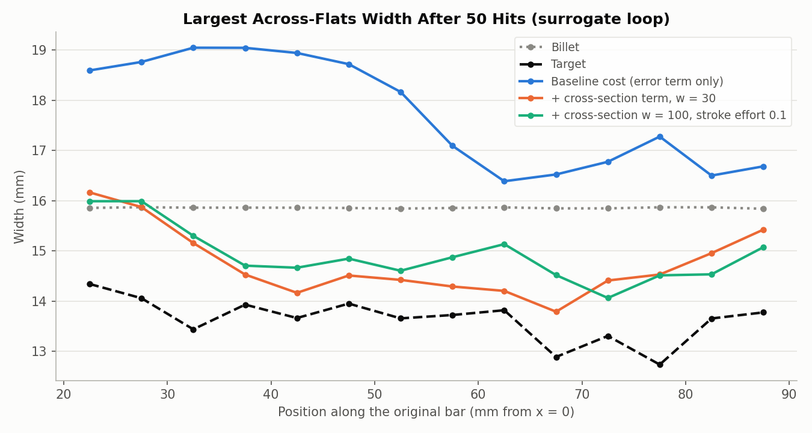
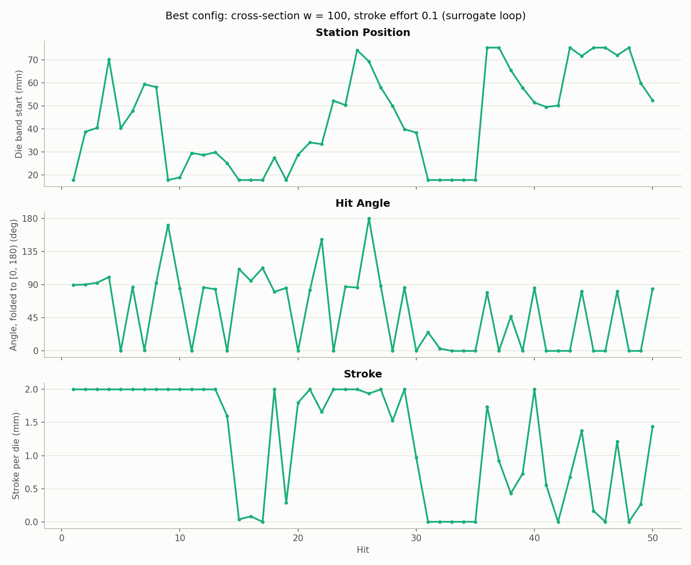
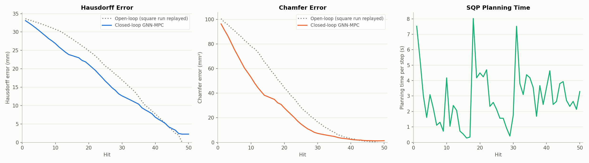

# Cost experiment 2: a cross-section term makes the MPC square the bar

**Date:** 2026-09-26 · **Script:** `control/cost_design.py` · **SLURM job:** 3886293 (6 configs) ·
**Raw output:** `control/results/surrogate/e2/e2_*/` · **Configs:** `exp2_cross_section_effort.json` (this folder)

## Summary

Experiment 1 showed the problem is the error term: 99% of it measures how far
nodes are from their target position *along the bar*, so the MPC stretches the
bar and ignores its cross-section. This experiment keeps that error term and
adds:
- **a cross-section term:** each node's squared distance from its target in the
  cross-section directions (y, z) only, with weight w
- **a stroke-effort penalty:** the classic ||u||² control-effort term on stroke size

**The cross-section term works** in the surrogate loop:
- **Squaring:** cross-section error falls from 3.18 mm (baseline) to 1.3-1.8 mm.
  The untouched billet scores 3.14 mm.
- **Angles:** hits alternate between 0° and 90°, roughly half each, as the real
  square schedule does.
- **No pinning:** at most 2 active hits in a row at one station (7 at w = 100
  alone), i.e. the 0°/90° pairs.
- **Best configuration: cross-section w = 100 plus stroke effort 0.1.**
  - Hausdorff to the target after 50 hits: 2.24 mm, vs. 8.12 mm for the baseline.
  - Chamfer: 1.32 vs. 4.80 mm².
  - The bar's free end ends at 35.1 mm, against the target's 35.0 mm.

Stroke effort alone helps a little at weight 0.1, and wrecks the run at 1.0.
These are surrogate results; real-simulator runs of the two best designs are
now running (jobs 3886361, 3886362).

## What was run

- **Test bed:** the same surrogate closed loop as experiment 1. The MPC plans
  with the M = 3 GNN (`GNN/mp_sweep/finetune/mp_3/checkpoint.pt`), and the same
  GNN stands in for the simulator. Target, 10-hit planning, 50 hits and control
  limits are unchanged.
- **Error term, always kept:** each surface node's squared distance from its
  target position, summed over the plan.
- **Added terms** (`control/mpc.py`, `MPCController(penalty=...)`):
  - **`transverse`, the cross-section term:** w × Σ over hits and nodes of the
    squared distance in y and z only. It's in the error's own units, so
    w = 100 makes cross-section shape roughly as important as the lengthwise
    error at the start (cross-section is 0.7% of the plain error there).
    Weights tried: 30, 100, 300.
  - **`effort_s`, stroke effort:** weight × Σ (stroke / 2 mm)², scaled so that
    weight 1 means a full 2 mm stroke costs one hit's share of the plan's
    starting error. Weights tried: 0.1, 1.
  - One combination: w = 100 with effort 0.1.
- **Metrics:** as in experiment 1. Cross-section error is the average gap
  between the bar's two across-flats widths and the target's, in 5 mm slices
  from x = 20 to 90 mm. Free end is the bar end's lengthwise displacement
  (target 35.0 mm).

## Results

| Config | Hausdorff, hit 50 (mm) | Chamfer, hit 50 (mm²) | Cross-section error (mm) | Free end (mm) | Active hits | Stations used | Longest active repeat | Angles near 0° / 90° | Mean planning time (s) |
|---|---|---|---|---|---|---|---|---|---|
| Baseline (experiment 1) | 8.12 | 4.80 | 3.18 | 42.1 | 34 | 22 | 3 | 53% / 18% | 1.90 |
| Cross-section, w = 30 | 3.64 | 1.65 | **1.31** | 37.1 | 37 | 20 | 2 | 46% / 49% | 2.21 |
| Cross-section, w = 100 | 8.60 | 3.93 | 1.78 | 27.4 | 31 | 16 | 7 | 65% / 35% | 1.42 |
| Cross-section, w = 300 | 8.23 | 3.39 | 1.51 | 27.2 | 28 | 15 | 2 | 43% / 46% | 2.33 |
| Stroke effort 0.1 | 7.19 | 3.37 | 2.37 | 41.0 | 35 | 20 | 4 | 46% / 29% | 2.50 |
| Stroke effort 1 | 20.99 | 28.56 | 3.78 | 16.6 | 50 | 1 | 50 | 20% / 22% | 0.81 |
| **Cross-section w = 100 + effort 0.1** | **2.24** | **1.32** | 1.39 | **35.1** | 39 | 17 | 2 | 41% / 49% | **2.90** |

"Active hits" have stroke > 0.1 mm; the rest are the MPC choosing not to
press. "Longest active repeat" is the most consecutive active hits at the
same station (2 = a 0°/90° pair). Mean errors over all 50 hits are in each
run's `results.json`. They're higher for the cross-section configs, because
these spend early hits on shape rather than the fastest error reduction, so
the final state is the fairer comparison.

The baseline leaves the bar wider than the billet (up to about 19 mm). Both
cross-section configs bring it down to about 14-15 mm along most of the
length, toward the target's 13-14 mm. The clamp end (x < 30 mm) stays closer
to billet size in all runs.

The best configuration forges in bursts: a few 0°/90° pairs at one station,
then it moves on. It revisits the clamp end several times and the free end
late in the run. It also takes zero-stroke "rests" (hits 15-17, 31-35), where
it apparently judged no hit worth its effort penalty.

Its Hausdorff and Chamfer fall steadily over all 50 hits and end close to
the square run's own endpoint, with no late creep like the baseline's.

## Analysis

- **The cross-section term fixes the objective.** With the plain error, a
  squared cross-section is worth under 1% of the cost, so it's never pursued.
  At w = 30-300 it's a large share, and the MPC responds the way a forger
  would: alternating 0°/90° hits at each station, then moving along the bar.
- **Too much weight stops the stretching.** At w = 100 and 300 alone, the free
  end only reaches about 27 mm of the target's 35 mm. The MPC works on shape
  and neglects length, which is why their Hausdorff stays high (8.2-8.6 mm).
- **A little stroke effort rebalances it.** Adding effort 0.1 to w = 100 gets
  both right: cross-section error 1.39 mm and free end 35.1 mm. A likely
  reason: with each hit costing something, the MPC uses fewer, more
  purposeful hits instead of chasing cross-section shape everywhere at once.
  This is an interpretation, not tested.
- **Too much effort paralyses it.** At effort 1 the MPC never leaves the first
  station and uses 0.2-1.0 mm strokes; after 50 hits it's still 21 mm
  (Hausdorff) from the target.

## Caveats

- **Surrogate only.** These runs trust the GNN completely. On the real
  simulator, the first MPC run behaved differently from its surrogate
  counterpart, and zero or very small strokes (common here) are outside the
  GNN's training range (0.5-2 mm). The real-simulator runs are the real test.
- One run per configuration, one target, a coarse weight grid.
- The best configuration still hits the clamp-side station (17.7 mm) often.
  On the real simulator, repeated hits there distorted the mesh until it
  failed, so that's worth watching.

## Next steps

- **Real-simulator runs** of the two best designs, cross-section w = 100 +
  effort 0.1 and w = 30 (jobs 3886361, 3886362, about 10 h each). They'll
  get their own report.
- **Refine the surrogate search around the best design:** w = 30-100 with
  effort 0.03-0.3.

## Files

- `figures/thickness_comparison.png`, `figures/best_controls.png` — made by
  `make_figures.py` here, from the runs' `final_state.npy` and `results.json`.
  Final states for runs made before `cost_design.py` saved them were rebuilt
  with `cost_design.replay_final_state`, and matched each run's logged final
  Hausdorff exactly.
- `figures/best_error_vs_hit.png` — copied from
  `control/results/surrogate/e2/e2_trans_100_effort_0.1/`.
- `exp2_cross_section_effort.json` — the six configurations.
