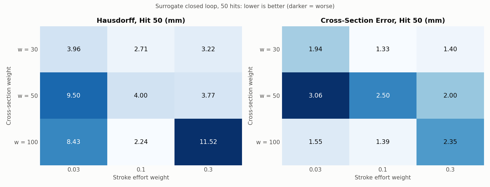
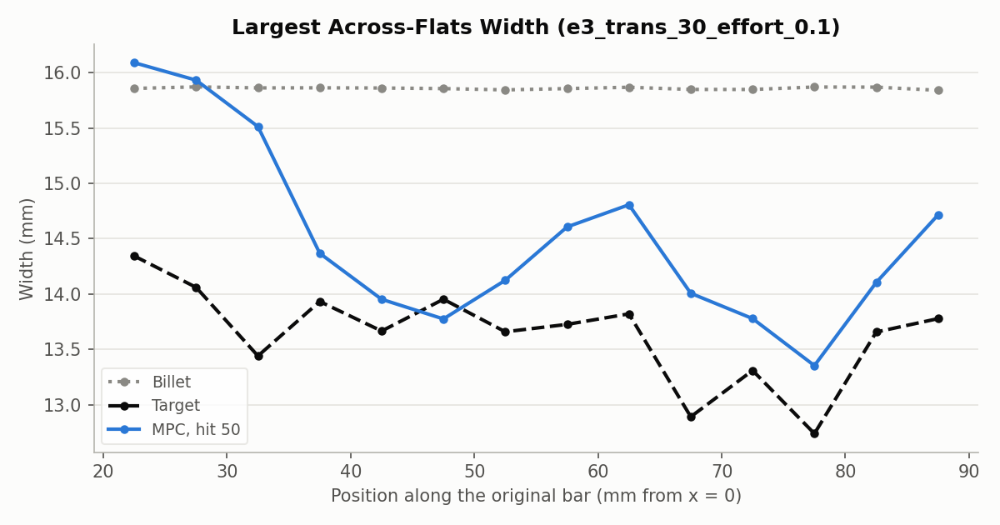
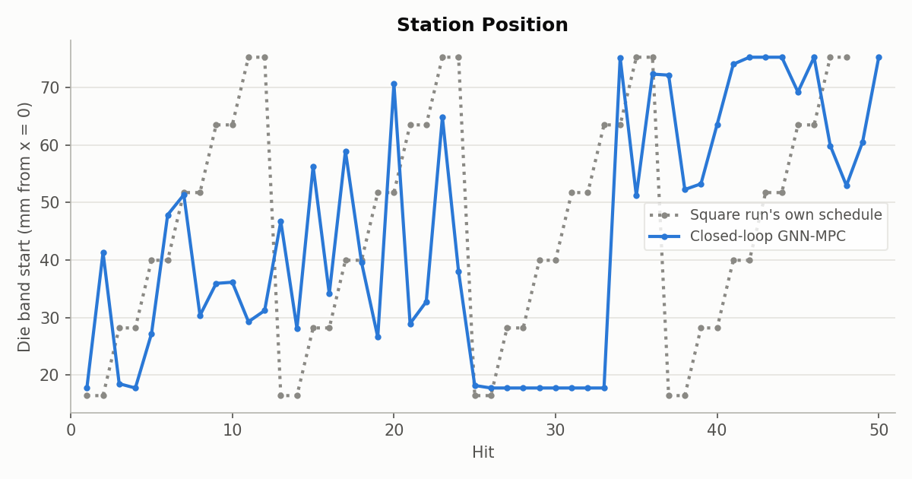
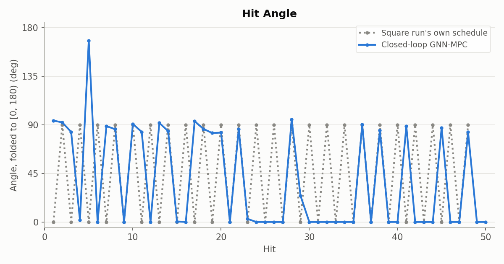

# Cost experiment 3: w = 30 is the robust setting; results are sensitive to weights

**Date:** 2026-09-26 · **Script:** `control/cost_design.py` · **SLURM job:** 3886366 (8 configs) ·
**Raw output:** `control/results/surrogate/e3/e3_*/` · **Configs:** `exp3_refine.json` (this folder)

## Summary

Experiment 2 found that adding a cross-section term (weight w) plus a small
stroke-effort penalty makes the surrogate MPC square the bar. This experiment
refined the two weights on a 3×3 grid: w = 30, 50, 100 against stroke effort
0.03, 0.1, 0.3.

**The results are not smooth in the weights.**
- **w = 30 is reliably good.** Effort 0.1 and 0.3 both finish well (Hausdorff
  2.7-3.2 mm, cross-section error 1.3-1.4 mm, free end 36-37 mm vs. the target
  35), and only effort 0.03 is noticeably worse.
- **w = 50 is worse than both its neighbours.**
- **w = 100 with effort 0.1** (experiment 2's best, Hausdorff 2.24 mm) is
  flanked by poor results at effort 0.03 and 0.3 (8.4 and 11.5 mm), so it may
  be a lucky run rather than a stable setting.

**Recommendation for the real simulator: w = 30 with stroke effort 0.1**
(Hausdorff 2.71 mm, Chamfer 1.50 mm², cross-section error 1.33 mm, free end
35.9 mm). Its neighbourhood is consistently good, it alternates 0°/90° hits,
and it uses the clamp-side station, where the mesh failed before, only 6 times.
A real-simulator run of it has been queued (job 3886393), alongside the two
from experiment 2.

## What was run

- **Test bed:** the same surrogate closed loop as experiments 1 and 2. M = 3
  GNN plans and stands in for the simulator; same target, 10-hit planning, 50
  hits, control limits.
- **Cost:** the error term (squared node distance to the target), plus the
  cross-section term with weight w, plus stroke effort with weight e. Both
  terms are defined in experiment 2's report.
- **Grid:** w ∈ {30, 50, 100} × e ∈ {0.03, 0.1, 0.3}. The (100, 0.1) cell is
  experiment 2's run; the other 8 are new.

## Results

| w | Effort | Hausdorff, hit 50 (mm) | Chamfer, hit 50 (mm²) | Cross-section error (mm) | Free end (mm) | Active hits | Longest active repeat | Angles near 0° / 90° | Active hits at clamp station | Mean planning time (s) |
|---|---|---|---|---|---|---|---|---|---|---|
| 30 | 0 (exp. 2) | 3.64 | 1.65 | 1.31 | 37.1 | 37 | 2 | 46% / 49% | 6 | 2.21 |
| 30 | 0.03 | 3.96 | 2.08 | 1.94 | 31.9 | 34 | 6 | 47% / 32% | 10 | 2.27 |
| **30** | **0.1** | **2.71** | **1.50** | **1.33** | **35.9** | 38 | 2 | 45% / 53% | 6 | 2.68 |
| 30 | 0.3 | 3.22 | 1.54 | 1.40 | 36.5 | 36 | 2 | 42% / 50% | 3 | 2.89 |
| 50 | 0.03 | 9.50 | 5.72 | 3.06 | 27.6 | 23 | 8 | 57% / 39% | 11 | 0.98 |
| 50 | 0.1 | 4.00 | 2.57 | 2.50 | 31.9 | 26 | 2 | 42% / 50% | 5 | 1.91 |
| 50 | 0.3 | 3.77 | 2.26 | 2.00 | 31.6 | 35 | 8 | 26% / 51% | 12 | 2.43 |
| 100 | 0.03 | 8.43 | 3.38 | 1.55 | 27.0 | 29 | 3 | 45% / 38% | 10 | 1.59 |
| 100 | 0.1 (exp. 2) | 2.24 | 1.32 | 1.39 | 35.1 | 39 | 2 | 41% / 49% | 3 | 2.90 |
| 100 | 0.3 | 11.52 | 7.06 | 2.35 | 25.6 | 25 | 2 | 36% / 56% | 8 | 1.43 |

For reference: the baseline cost (no added terms) gives Hausdorff 8.12 mm,
cross-section error 3.18 mm and free end 42.1 mm; the untouched billet's
cross-section error is 3.14 mm. "Clamp station" means active hits at the
lowest allowed station (band start ≤ 18.5 mm).

The recommended configuration brings the bar within about 1 mm of the target's
width from x ≈ 40 mm to the free end. The clamp end (x < 35 mm) stays close to
billet size.

It works up and down the bar in passes, with angles alternating between 0°
and 90°.

## Analysis

- **Where the pattern is clear:** effort 0.1-0.3 with w = 30 finishes
  well; very low effort (0.03) tends to under-stretch the bar (free end 27-32
  mm), consistent with experiment 2's finding that some effort penalty helps.
- **Why results jump between neighbouring weights:** each of the 50 re-plans
  is a local optimization from a warm start. A small change in weights can
  change one early decision, and the rest of the run then follows a different
  path. The surrogate loop is effectively a chaotic system over 50 hits, so a
  single run per configuration overstates how precisely weights can be ranked.
- **Robustness matters more than the single best number** for picking a design
  to test on the real simulator, since the simulator's responses will differ
  from the GNN's. w = 30 is the only row where every effort value gives a
  reasonable result.

## Caveats

- Surrogate loop only: the GNN is trusted completely, and many hits use small
  or zero strokes, outside its 0.5-2 mm training range.
- One run per cell; the grid's roughness suggests run-to-run spread of the same
  order as the differences between neighbouring cells.

## Next steps

- **Real-simulator runs:** w = 30 + effort 0.1 (job 3886393), plus experiment
  2's w = 100 + effort 0.1 (3886361) and w = 30 alone (3886362). About 10 h
  each; each gets a report.
- If the real runs agree with the surrogate, measure robustness properly:
  repeat the best configurations from slightly perturbed starting guesses, to
  get a spread per setting.

## Files

- `figures/grid.png` — made by `make_grid_figure.py` here, from each run's
  `results.json`.
- `figures/thickness_profile.png`, `figures/controls_station.png`,
  `figures/controls_angle.png` — copied from
  `control/results/surrogate/e3/e3_trans_30_effort_0.1/`.
- `exp3_refine.json` — the eight new configurations.
