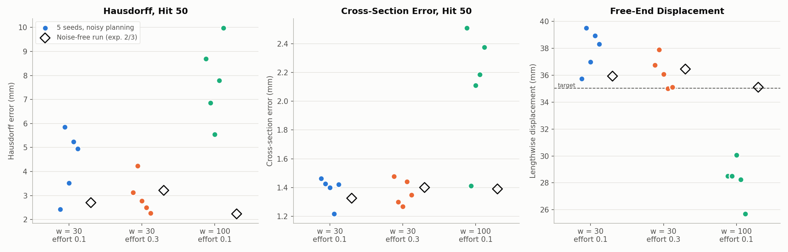

# Cost experiment 4: w = 30 + stroke effort 0.3 is the most robust design

**Date:** 2026-09-26 · **Script:** `control/cost_design.py` (`--init-noise`, `--seed`) ·
**SLURM job:** 3886406 (15 runs) · **Raw output:** `control/results/surrogate/e4/e4_*/` ·
**Configs:** `exp4_robustness.json` (this folder)

## Summary

Experiment 3's grid was uneven: neighbouring weight settings gave very
different results. That suggested single runs can't be trusted to rank
designs. This experiment measured the spread directly. Each of the three
leading designs was rerun 5 times with small random changes. Before each
re-plan, the optimizer's **starting guess** for the 10 planned hits was
shifted by random amounts, typically (one standard deviation) about 1.2 mm of
station position, 7° of angle and 0.04 mm of stroke (Gaussian noise, 2% of
each control's range). The optimizer then ran as usual from that shifted start, so any
difference in the result shows how sensitive the design is to where the
optimization begins. That's a
stand-in for the small differences a real simulator will introduce.

- **w = 100 + effort 0.1, experiment 2's "best," was a lucky run.** With the
  nudges, its final Hausdorff is 7.8 ± 1.7 mm (vs. 2.24 mm without), and
  it under-stretches the bar every time (free end 28 ± 2 mm vs. the target 35).
- **w = 30 + effort 0.3 is the most robust:**
  - Hausdorff 3.0 ± 0.8 mm, every seed at or below 4.2 mm
  - Chamfer 1.51 ± 0.11 mm²
  - cross-section error 1.37 ± 0.09 mm
  - free end 36.2 ± 1.2 mm
- **w = 30 + effort 0.1** squares the bar as well (cross-section error
  1.39 ± 0.10 mm), but its final Hausdorff varies more (4.4 ± 1.4 mm) and it
  stretches the bar slightly too far (37.9 ± 1.5 mm).

**Updated recommendation: cross-section weight w = 30 with stroke effort 0.3.**
A real-simulator run of it has been added (job 3886507), next to the three
already running.

## What was run

- **Test bed:** the surrogate closed loop from experiments 1-3. The M = 3 GNN
  plans and stands in for the simulator; same target, 10-hit planning, 50 hits,
  control limits.
- **Designs:** the error term plus a cross-section term with weight w and
  stroke effort e, at (w, e) = (30, 0.1), (30, 0.3) and (100, 0.1).
- **Perturbation:** before every re-plan, Gaussian noise with standard
  deviation 2% of each control's range (about 1.2 mm of station, 7° of angle,
  0.04 mm of stroke) was added to the starting guess, clipped to the bounds.
  Seeds 0-4 per design. The optimizer still runs to convergence; only its
  starting point moves.

## Results

Mean ± standard deviation over the 5 seeds, with the noise-free run in brackets:

| Design | Hausdorff, hit 50 (mm) | Chamfer, hit 50 (mm²) | Cross-section error (mm) | Free end (mm, target 35.0) | Active hits | Longest active repeat | Mean planning time per hit (s) |
|---|---|---|---|---|---|---|---|
| w = 30, effort 0.1 | 4.40 ± 1.39 [2.71] | 1.77 ± 0.23 [1.50] | 1.39 ± 0.10 [1.33] | 37.9 ± 1.5 [35.9] | 39.4 ± 1.5 | 2.2 ± 0.4 | 3.27 ± 0.16 |
| **w = 30, effort 0.3** | **2.98 ± 0.77** [3.22] | **1.51 ± 0.11** [1.54] | **1.37 ± 0.09** [1.40] | **36.2 ± 1.2** [36.5] | 39.4 ± 2.1 | 3.4 ± 0.5 | 2.93 ± 0.12 |
| w = 100, effort 0.1 | 7.78 ± 1.70 [2.24] | 3.85 ± 1.35 [1.32] | 2.12 ± 0.42 [1.39] | 28.2 ± 1.6 [35.1] | 27.8 ± 4.9 | 5.0 ± 0.7 | 2.30 ± 0.49 |

Each dot is one seed; the open diamond is the noise-free run. For both w = 30
designs, the noise-free run sits inside its seeds' spread. For w = 100 it's
far from all five seeds on every metric: that noise-free result isn't
representative of the design.

Per-seed values are in each run's `results.json`
(`control/results/surrogate/e4/e4_<design>_seed<n>/`).

## Analysis

- **The cross-section error is robust in every design,** with a spread of
  about 0.1 mm at w = 30. The bar gets squared reliably. What varies is how far
  the bar is stretched, which drives the Hausdorff differences, since Hausdorff
  is dominated by the free end's position.
- **w = 100 over-weights shape.** Given the chance, it keeps working the cross-section
  and stops stretching, ending 7 mm short in length. Its one good noise-free run
  happened to take a path that did both.
- **More stroke effort at w = 30 gives better length control.** Effort 0.3
  reduces overshoot (36.2 vs. 37.9 mm) and the spread of Hausdorff (0.8 vs.
  1.4 mm), at the cost of slightly longer runs of hits at one station (up to
  3-4 vs. 2).

## Caveats

- Still surrogate-only; the nudges mimic, but aren't, real-simulator
  differences.
- Five seeds per design gives a rough spread, not a precise one.

## Next steps

- **Real-simulator runs** (about 10 h each), each to be reported when done:
  - w = 30 + effort 0.3 (job 3886507), now the lead candidate
  - w = 30 + effort 0.1 (3886393)
  - w = 30 alone (3886362)
  - w = 100 + effort 0.1 (3886361). Kept running as a check on whether the
    real simulator agrees with the surrogate that it's unreliable.

## Files

- `figures/robustness_spread.png` — made by `make_spread_figure.py` here, from
  the 15 runs' and the noise-free runs' `results.json`.
- `exp4_robustness.json` — the 15 run configurations.
