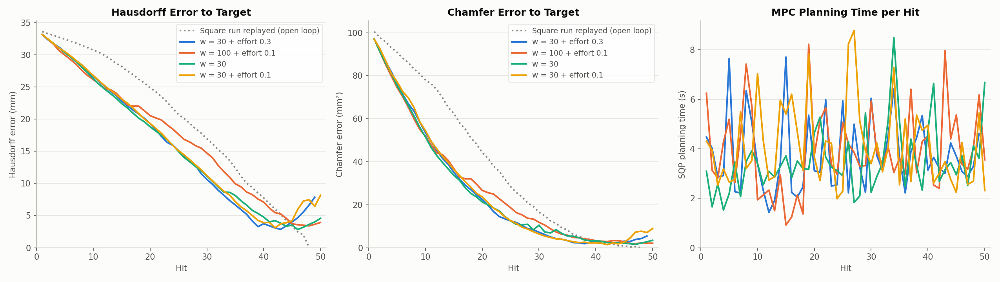
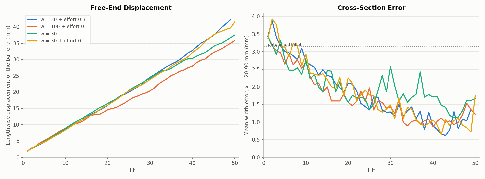
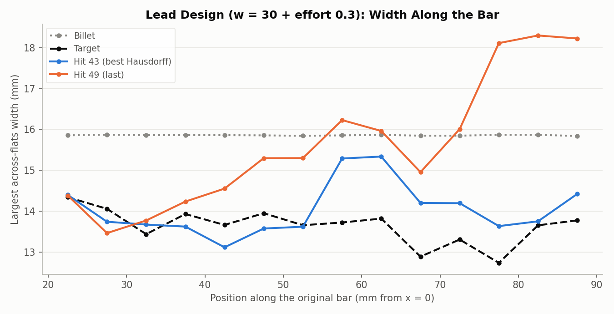
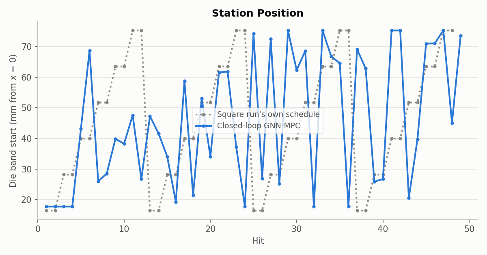
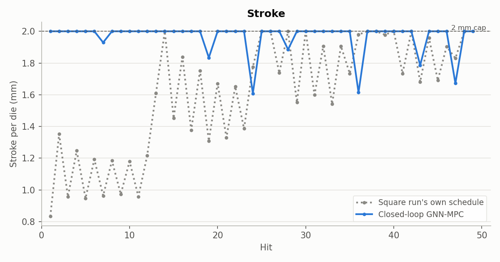

# Cost experiment 5: real-simulator check -- the new costs reach the square rod, then overshoot

**Date:** 2026-09-26 · **Script:** `control/eval_square_target.py --penalty ...` ·
**SLURM jobs:** 3886393, 3886514, 3886515, 3886507 → 3886751 → 3887889 (lead design, two resumes) ·
**Raw output:** `control/results/real_simulator/e5_<design>/`

## Summary

The four cost designs from the surrogate experiments were each run for up to
50 hits against the real FE simulator, with the M = 3 GNN planning. All four
use the original node-distance error plus the cross-section term (weight w),
and three add stroke effort.

**All four forged the bar to very near the target shape.** At each run's best
hit, the free end was within about 1 mm of the target's 35 mm stretch.
Cross-section error was 0.61-1.53 mm, against 3.14 mm for the untouched
billet. The lead design (w = 30 + effort 0.3) reached **Hausdorff 2.86 mm,
cross-section error 0.61 mm and free end 35.7 mm at hit 43**. That's the best
real-simulator result so far, and far ahead of the first MPC run, which pinned
one station and failed at hit 11.

**Then they kept going.** None of the runs stopped hitting. The bar kept
stretching at about 0.8 mm per hit past the target length, and the late hits
at the free end made it bulge there. Two runs ended far worse than their best
(Hausdorff 7.9-8.2 mm, free end 41.5-42.2 mm). The lead design's simulator
failed twice in the reheat step: once at hit 9, fixed by a resume, and again
before hit 50 after the free end had been heavily distorted.

The "hitting the same spot" problem is gone. What's left is **knowing when to
stop**.

## What was run

- **Plant:** the real FE simulator (`ForgingPlant`), exactly as in the first
  MPC run. Target: the square run's hit-48 shape. Planning 10 hits ahead, up to
  50 hits. Station from the 800 °C point (17.7 mm) to 75.3 mm, angle 0-360°,
  stroke 0-2 mm.
- **Planner:** the GNN with **M = 3 message-passing steps** (`GNN/mp_sweep/finetune/mp_3/checkpoint.pt`), SLSQP.
  (Experiment 0, the first MPC run, used the M = 5 model.)
- **Designs** (see the experiment 2-4 reports for the cost terms):

| Design | Cross-section weight w | Stroke effort | Surrogate prediction (hit 50 Hausdorff) |
|---|---|---|---|
| w = 30 + effort 0.3 (lead) | 30 | 0.3 | 2.98 ± 0.77 mm (5 seeds) |
| w = 100 + effort 0.1 | 100 | 0.1 | 7.78 ± 1.70 mm (5 seeds) |
| w = 30 | 30 | 0 | 3.64 mm (1 run) |
| w = 30 + effort 0.1 | 30 | 0.1 | 4.40 ± 1.39 mm (5 seeds) |

- **Failures:** the lead run's simulator failed before hit 9. It was resumed
  unchanged (the choice made for square_jitter_seed2's identical failure) and
  got past it, then failed again before hit 50. A second resume failed at the
  same point, so that run has 49 hits. The other three completed 50. The
  w = 100 and w = 30 runs were also restarted once early on, from hit 0,
  because their first node (gput063) ran about 6× slower than normal.

## Results

**Errors** ("best hit" is the hit with the lowest Hausdorff error):

| Design | Best hit | Hausdorff at best (mm) | Chamfer at best (mm²) | Final hit | Final Hausdorff (mm) | Final Chamfer (mm²) |
|---|---|---|---|---|---|---|
| **w = 30 + effort 0.3** | 43 | **2.86** | 2.11 | 49 | 7.86 | 5.48 |
| w = 100 + effort 0.1 | 48 | 3.41 | 2.30 | 50 | 3.93 | 2.12 |
| w = 30 | 46 | 2.83 | 1.88 | 50 | 4.57 | 3.49 |
| w = 30 + effort 0.1 | 42 | 3.10 | 1.46 | 50 | 8.16 | 8.91 |
| Experiment 0 (original cost, M = 5) | 11 | 27.24 | 60.40 | 11 (failed) | 27.24 | 60.40 |

**Computation time per hit:**

| Design | MPC planning time, mean (s) | median (s) | max (s) | Simulator time per hit, mean (min) |
|---|---|---|---|---|
| w = 30 + effort 0.3 | 3.76 | 3.29 | 7.71 | 10.1 |
| w = 100 + effort 0.1 | 3.91 | 3.59 | 8.23 | 9.2 |
| w = 30 | 3.53 | 3.27 | 8.49 | 11.7 |
| w = 30 + effort 0.1 | 4.12 | 3.79 | 8.78 | 9.8 |
| Experiment 0 (original cost, M = 5) | 3.90 | 4.00 | 7.23 | 16.0 |

Planning time is the MPC's own cost (10 hits ahead, GNN gradients on an L40S
GPU); simulator time is the real FE hit, which stands in for the press.

All four runs cut Hausdorff and Chamfer error faster than the square run's own
trajectory (dotted) for most of the run, then Hausdorff rises again after hits
42-48 in the runs that overshoot. Planning takes 1-9 s per hit throughout,
with no trend over the run, which is small next to the ~10 min simulated hit.

**Shape at the best hit:**

| Design | Cross-section error at best (mm) | Free end at best (mm) | Final cross-section error (mm) | Final free end (mm) |
|---|---|---|---|---|
| w = 30 + effort 0.3 | **0.61** | 35.7 | 1.37 | 42.2 |
| w = 100 + effort 0.1 | 1.53 | 34.2 | 1.23 | 35.8 |
| w = 30 | 1.14 | 34.6 | 1.67 | 37.5 |
| w = 30 + effort 0.1 | 0.65 | 34.0 | 1.76 | 41.5 |

Target free end: 35.0 mm; untouched billet cross-section error: 3.14 mm.

The free end stretches at a near-constant rate and **never levels off**:
each run crosses the target length around hits 42-48 and keeps going. The
cross-section error falls unevenly to its lowest (0.6-1.2 mm) around the same
hits, then rises again in the runs that overshoot most.

At hit 43 the lead bar matches the target's width to within about 1 mm along
nearly its whole length (x = 20-90 mm). By hit 49, the late hits near the free
end have pushed the width there up to 18.3 mm, wider than the 15.9 mm billet.

The lead design spreads its hits over 21 stations with 0°/90° pairs, and
uses full 2 mm strokes to the end: 0 zero-stroke hits.

### Station spread (the original "same spot" problem)

| Run | Stations used | Longest streak at one spot | Active hits at the clamp station |
|---|---|---|---|
| First MPC run (old cost, M = 5) | 1 | 11 | 11 of 11 |
| w = 30 + effort 0.3 | 21 | 4 | 7 of 44 |
| w = 100 + effort 0.1 | 20 | 2 | 12 of 46 |
| w = 30 | 19 | 7 | 11 of 37 |
| w = 30 + effort 0.1 | 17 | 4 | 9 of 47 |

(Counted from each run's results when checked at 44-48 hits; the final few
hits don't change the picture.)

### Mesh distortion at the end of each run

| Run | Smallest element volume | Elements below 80% volume | Where |
|---|---|---|---|
| w = 30 + effort 0.3 | 37% | 359 | free end, x ≈ 92 mm |
| w = 100 + effort 0.1 | 55% | 31 | free end, x ≈ 94 mm |
| w = 30 | 60% | 11 | free end, x ≈ 94 mm |
| w = 30 + effort 0.1 | 39% | 561 | free end, x ≈ 94 mm |

The two runs that overshot the most also distorted the free end the most. The
lead run's final failure is the same reheat failure seen before, now caused
by that free-end damage. Its earlier hit-9 failure was milder (worst element
at 74% volume, near the clamp end) and passed on resume.

## Why it overshoots

- **The MPC never judged itself done.** On the real simulator it chose 0-2
  zero-stroke hits per run; in the surrogate loop it regularly stopped hitting
  near the target. From the real bar's state, the GNN kept predicting that
  another full hit would lower the cost.
- **A likely cause (not verified):** near the target, the GNN underestimates
  how much a free-end hit stretches and widens the real bar. Its one-hit
  prediction error stayed at about 0.3 mm on average, but the cost trade-off
  near the target is decided by millimetre-level differences. The predicted
  states weren't saved, so this can't be checked directly from these runs.
- **The cost also keeps rewarding more squeezing** as long as some slices are
  wider than the target, and every squeeze also stretches the bar. Hitting
  shape and length exactly at the same time is hard with 2 mm full strokes
  near the end.

## Conclusions

1. **The cross-section term works on the real simulator,** not just the
   surrogate. The MPC spreads hits along the bar in 0°/90° pairs and forms a
   square rod close to the target (best Hausdorff 2.8-3.4 mm, cross-section
   error 0.6-1.5 mm, free end within 1 mm of target).
2. **The remaining problem is stopping.** Every run passes the target and
   keeps hitting; its best state comes at hits 42-48.
3. **The surrogate's ranking of designs didn't carry over exactly.** w = 100 +
   effort 0.1, which the surrogate robustness test flagged as unreliable, had
   the best *final* state here (3.93 mm), largely because it overshot least.
   Best-hit results were similar for all four, so the choice between them
   matters less than fixing the stopping.

## Possible next steps

- **A stopping rule:** stop when the GNN predicts that no plan improves the
  cost by more than a small threshold. Or, closer to real practice, stop when
  a measured shape (Colton's toolpaths already have `scan_after` flags) stops
  improving, and keep the best state.
- **Cost terms that punish overshoot:** e.g. an extra penalty only when the
  bar is longer than the target, or a terminal cost that weights the plan's
  end state more.
- **Retrain the GNN on these runs' real states** (the DAgger-style data
  collection planned for tomorrow). This gives it data exactly where it's
  weak: near-target states and late free-end hits.
- **Save the GNN's predicted state each hit** in `eval_square_target.py`, so
  prediction-vs-reality can be analysed directly.

## Files

- `figures/errors_and_time_real.png`, `figures/stretch_and_cross_section.png`,
  `figures/lead_width_best_vs_last.png` — made by `make_figures.py` here, from
  each run's `results.json`, `step_XX.vtu` and `target.vtu`. It also writes
  `metrics.json` (per-hit series for all four runs, including planning time).
- `figures/lead_controls_station.png`, `figures/lead_controls_stroke.png` —
  copied from `control/results/real_simulator/e5_w30_effort0.3/`.
