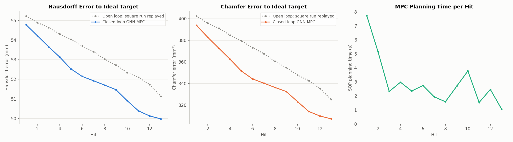
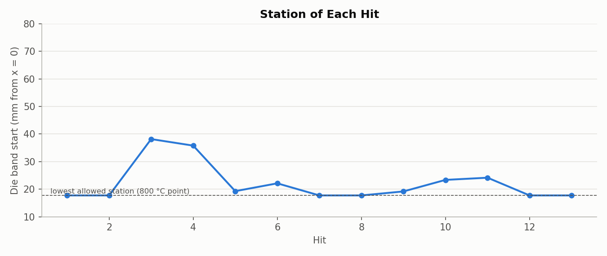
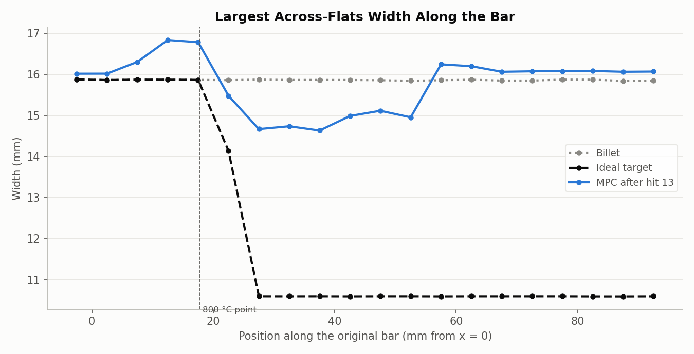

# Cost experiment 6: toward the ideal square target, the lead design keeps hitting the clamp end

**Date:** 2026-09-26 · **Script:** `control/eval_square_target.py --target-vtu ...` ·
**SLURM job:** 3888361 (stopped by request after hit 13) ·
**Raw output:** `control/results/real_simulator/e6_ideal_w30_effort0.3/`

## Summary

The lead cost design from experiments 2-5 (error + 30 × cross-section + 0.3 ×
stroke effort, M = 3 GNN) was run on the real simulator toward the new
**idealized target**, a volume-conserving 10.6 × 10.6 mm square rod, 158.2 mm
long (`control/targets/ideal_square_10.6/`).

It did poorly, so it was stopped after 13 hits:
- **62% of hits** (8 of 13) landed at or next to the lowest allowed station,
  by the clamp. Only three stations were used, and the far half of the bar was
  never touched.
- **The clamp end bulged** to 16.8 mm wide (target: 15.9 mm round).
- **The middle got to 14.6-15.1 mm** (target: 10.6 mm).
- **The free end moved 6.8 of the 56.6 mm** the target requires.
- **Mesh damage was starting** at the clamp-side band edge (worst element at
  78% of its volume, x ≈ 18 mm), the same place earlier runs failed.

Its Hausdorff and Chamfer errors beat the open-loop reference at every hit.
Both errors, though, are dominated by how far the bar still has to stretch.

**Cause:** for this target the cross-section is only **0.36%** of the starting
error, because the part must stretch 56.6 mm. The weight w = 30, tuned on the
old square target (35 mm stretch), raises it to only about 10% of the cost.
Pressing next to the clamp moves every node downstream toward its target
position, so length wins again.

## What was run

- **Target:** `ideal_square_10.6/target_on_billet.vtu`:
  - round Ø15.9 mm from the clamp face to the 800 °C point (x = 17.7 mm)
  - a 7.5 mm taper (19.4° flank angle)
  - a 10.6 × 10.6 mm square to the end, 158.2 mm long in total
  - each surface node mapped to the target by volume conservation
  - nominal (cool) dimensions; the simulated bar is hot and about 1.2%
    larger, neglected here by decision
- **Planner:** M = 3 GNN (`GNN/mp_sweep/finetune/mp_3/checkpoint.pt`), 10-hit
  horizon.
- **Cost:** J = E + 30·E⊥ + 0.3·(E₀/K)·Σ(s_k / 2 mm)², as in
  `2026-09-26_mpc_cost_function/cost_function.pdf`.
- **Limits:** station 17.7-75.3 mm, angle 0-360°, stroke 0-2 mm. Planned for 50
  hits, with up to 2 automatic resumes on simulator failure (none were needed).
- **Open-loop reference:** the square run's 48 hits, replayed and scored
  against **this ideal target**. It never reaches it: after hit 48 it is still
  22.7 mm (Hausdorff) and 39.8 mm² (Chamfer) away.

## Results

| Hit | Hausdorff, MPC (mm) | Hausdorff, open loop (mm) | Chamfer, MPC (mm²) | Chamfer, open loop (mm²) |
|---|---|---|---|---|
| 1 | 54.79 | 55.23 | 393.8 | 402.5 |
| 5 | 52.53 | 54.04 | 351.6 | 379.5 |
| 9 | 51.47 | 52.73 | 332.5 | 354.8 |
| 13 | 49.98 | 51.13 | 307.2 | 325.2 |

Undeformed billet vs. the ideal target: Hausdorff 56.6 mm, Chamfer 430.7 mm².

**Computation time:** MPC planning 2.95 s per hit on average (median 2.47 s,
max 7.74 s); simulator 10.1 min per hit. One of 13 plans (hit 1) stopped at
the optimizer's 100-iteration limit rather than converging; the other 12
converged.

Stations: 18, 18, 38, 36, 19, 22, 18, 18, 19, 23, 24, 18, 18 mm (band start).
Every hit fell between 17.7 and 38 mm; the bar beyond about 57 mm was never
pressed.

Between x ≈ 25 and 55 mm the bar is down to about 14.6-15.1 mm across. Next
to the clamp it has bulged above the billet's 15.9 mm, and beyond about 57 mm
it is untouched.

## Why: the weight isn't matched to this target

| | Old square target | Ideal square target |
|---|---|---|
| Stretch needed at the free end | 35.0 mm | 56.6 mm |
| Cross-section share of the starting error | 0.74% | 0.36% |
| Cross-section share of the starting cost at w = 30 | ~19% | ~10% |
| w giving equal lengthwise and cross-section shares | ~132 | ~276 |

The weight w = 30 was selected on the old target. A longer target makes the
lengthwise part even more dominant, so the same w gives the cross-section half
the say it had before. The MPC falls back to what reduces lengthwise error
fastest: pressing next to the clamp.

## Conclusions

1. **A fixed w doesn't transfer between targets.** The right weight depends
   on how much the target needs to stretch versus be reshaped.
2. **The weight should be derived from the target,** e.g. chosen so the
   cross-section is a set share of the starting cost. That also answers the
   criticism that w was tuned ad hoc. This is experiment 7.

## Caveats

- Only 13 hits; the run was stopped deliberately once its behaviour was clear.
- Hausdorff and Chamfer against this target are dominated by length early on,
  so "better than open loop" says little about shape here. The width profile
  is the more telling measure.

## Files

- `figures/errors_and_time.png`, `figures/width_along_bar.png`,
  `figures/stations.png` — made by `make_figures.py` here, from the run's
  `results.json`, `target.vtu` and `step_13.vtu`.
