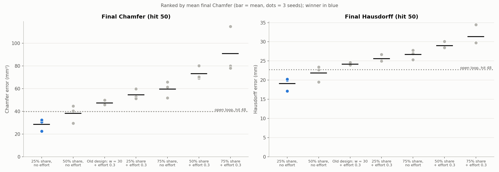
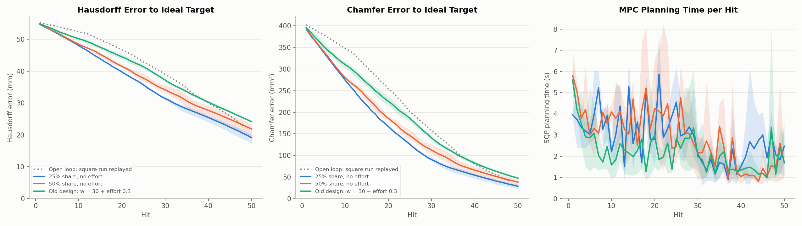
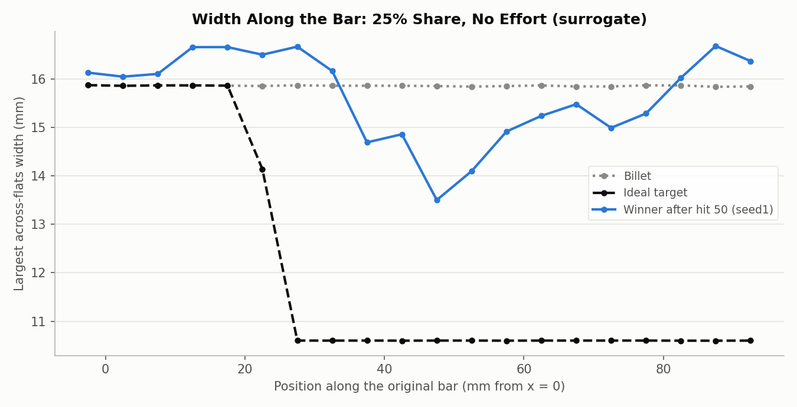

# Cost experiment 7: a target-derived cross-section weight (25% share, no effort) ranks first, but 50 hits are far from enough

**Date:** 2026-09-26 · **Script:** `control/cost_design.py` (`--cs-share`, `--target-vtu`) ·
**SLURM job:** 3889445 (21 runs) · **Raw output:** `control/results/surrogate/e7/` ·
**Configs:** `exp7_cs_share_ideal.json` (this folder)

## Summary

Experiment 6 showed that the hand-picked cross-section weight w = 30 doesn't
carry over to the ideal square target: for that target it gave cross-section
shape only ~10% of the cost. This experiment replaces the hand-picked weight
with a rule tied to the target. w is set so that the cross-section term is a
chosen **share** of the cost at the first step (billet vs. target):
25%, 50% or 75%. Each share was run with and without stroke effort, 3 times
each (small random changes to the optimizer's starting guess), plus the old
design as a comparison. The ranking rule was fixed before the runs: **mean
final Chamfer, then mean final Hausdorff.**

**Winner: 25% share, no stroke effort (w = 91.4).**
- Final Chamfer 28.5 ± 5.3 mm² and Hausdorff 19.1 ± 1.7 mm after 50 hits.
- That's better than the open-loop square run's own endpoint scored on the same
  target (39.8 mm², 22.7 mm after 48 hits), and better than the old design
  (47.4 mm², 24.2 mm).
- Stroke effort made every share worse, and higher shares were worse too.

**But no design gets close to the ideal part in 50 hits.** The winner's
free end moves 38.3 of the 56.6 mm needed, and its bar is still 13.5-16.7 mm
wide where the target is 10.6 mm. Its lead comes mostly from stretching the
bar further; at this stage both Chamfer and Hausdorff are dominated by length.
All results are from the surrogate loop, where the GNN stands in for the
simulator. The winner is now running on the real simulator (job 3889543,
experiment 8).

## What was run

- **Test bed:** surrogate closed loop (`control/cost_design.py`). The M = 3 GNN
  (`GNN/mp_sweep/finetune/mp_3/checkpoint.pt`) both plans and stands in for
  the simulator. 10-hit horizon, 50 hits. Station 17.7-75.3 mm, angle 0-360°,
  stroke 0-2 mm.
- **Target:** the ideal square (`control/targets/ideal_square_10.6/`): round to
  the 800 °C point, 7.5 mm taper, 10.6 × 10.6 mm square, 158.2 mm total.
- **Cost:** J = E + w·E⊥ + e·(E₀/K)·Σ(s_k / 2 mm)², with the terms as defined in
  `2026-09-26_mpc_cost_function/cost_function.pdf`.
- **How w is set, the new part:** at the first step (undeformed billet vs.
  target), the error splits into a lengthwise part E_len,0 = 3,648,303 and a
  cross-section part E_cs,0 = 13,165. For a desired cross-section share s:

  w = s / (1 − s) · E_len,0 / E_cs,0 − 1

  so that (1 + w)·E_cs,0 is exactly the fraction s of the starting cost. It
  gives w = 91.4 (25%), 276.1 (50%) and 830.3 (75%). For comparison, the old
  w = 30 corresponds to a 10.1% share for this target.
- **Designs:** shares 25/50/75% × stroke effort e = 0 or 0.3, plus the old
  design (w = 30, e = 0.3). 3 seeds each: before every re-plan, the optimizer's
  starting guess was shifted randomly (standard deviation 2% of each control's
  range).
- **Ranking rule, set before the runs:** mean final Chamfer over the seeds,
  ties broken by mean final Hausdorff.

## Results

Mean ± sample standard deviation over 3 seeds, after hit 50, in ranked order:

| Rank | Design | w | Final Chamfer (mm²) | Final Hausdorff (mm) | Cross-section error (mm) | Free end (mm, target 56.6) | Planning time per hit (s) |
|---|---|---|---|---|---|---|---|
| **1** | **25% share, no effort** | **91.4** | **28.5 ± 5.3** | **19.11 ± 1.70** | 3.57 | **38.3** | 2.86 |
| 2 | 50% share, no effort | 276.1 | 38.2 ± 7.7 | 21.86 ± 2.09 | 3.57 | 35.5 | 2.92 |
| 3 | Old design: w = 30 + effort 0.3 | 30 | 47.4 ± 2.3 | 24.15 ± 0.38 | 4.25 | 33.8 | 2.18 |
| 4 | 25% share + effort 0.3 | 91.4 | 54.6 ± 4.7 | 25.60 ± 0.97 | 4.06 | 32.4 | 2.36 |
| 5 | 75% share, no effort | 830.3 | 59.7 ± 7.1 | 26.66 ± 1.28 | 3.68 | 31.2 | 2.44 |
| 6 | 50% share + effort 0.3 | 276.1 | 73.2 ± 6.0 | 28.97 ± 0.95 | 3.99 | 29.2 | 2.27 |
| 7 | 75% share + effort 0.3 | 830.3 | 91.0 ± 20.6 | 31.37 ± 2.70 | 3.67 | 26.0 | 2.79 |

Reference points against the ideal target:
- **Open-loop square run after hit 48:** Chamfer 39.8 mm², Hausdorff 22.7 mm.
- **Untouched billet:** cross-section error 5.00 mm, Hausdorff 56.6 mm,
  Chamfer 430.7 mm².

Planning takes 2-3 s per hit on average for every design. The per-seed values
are in `summary.json`.

The winner's three seeds all beat every seed of the designs ranked 3-7 on
Chamfer. Only the 50% share, no effort design overlaps with it (one seed at
29.6 mm²).

Hausdorff and Chamfer for the winner (blue), runner-up (orange) and old design
(aqua): mean over seeds, with shading showing the min-max. The open-loop square
run is dotted. The winner is ahead of the open loop at every hit. Planning time,
averaged over seeds, stays between 0.8 and 5.9 s per hit for all three
(single worst plan: 8.2 s).

The winner's bar (median seed, seed 1) after 50 hits is thinnest in the
middle, 13.5-15.5 mm across between x ≈ 35 and 80 mm, against the target's
10.6 mm. Next to the clamp (x ≈ 10-30 mm) and at the free end it has bulged
to 16.5-16.7 mm, wider than the 15.9 mm billet. The cross-section is only
partly formed.

## Analysis

- **Stroke effort hurts on this target.** It lowers the stroke, so the bar
  stretches less (free end 26-32 mm with effort vs. 31-38 mm without), and
  both errors rise at every share. It helped on the old square target, which
  needed less stretch; here it works against the main task.
- **A higher share also means less stretching.** The MPC spends more hits on
  shape (free end 38 → 36 → 31 mm from 25% to 75%). With only 50 hits, length
  is what the errors measure most, so the lower share ranks best.
- **Cross-section progress is similar and small everywhere:** 3.6-4.3 mm
  against 5.0 for the billet. None of the designs gets close to the square in
  50 hits. The ranking mostly reflects stretch.
- **The old design doesn't pin the clamp here** (active-hit streaks around 6)
  as it did on the real simulator (experiment 6). The surrogate loop again
  behaves differently from the real plant.

## Conclusions

1. **Setting w from a target share is workable and principled.** It adapts
   automatically to how much stretching versus reshaping a target needs, which
   hand-picked weights don't.
2. **For the ideal target, 25% share with no stroke effort is best** by the
   pre-set rule, clearly ahead of the old design.
3. **50 hits are far too few for this part,** even in the surrogate. A fair
   test of reaching the target needs more hits (roughly 75 if the winner's
   average stretch rate, 0.77 mm per hit, held up).

## Caveats

- Surrogate loop only: the GNN is trusted completely, and it has never seen
  bars this thin or this long.
- 3 seeds per design; the gaps between ranks 1 and 2 overlap in one seed.
- Early on, Chamfer and Hausdorff mostly measure length. A ranking on
  cross-section shape alone would be almost flat.
- The hot bar is compared with nominal (cool) dimensions (~1.2% difference),
  neglected by decision.

## Next steps

- **Experiment 8:** the winner on the real simulator, 50 hits (job 3889543,
  with automatic resume).
- **Give the ideal target enough hits** (e.g. 80-100) before judging whether
  the MPC can finish the part.

## Files

- `figures/ranking.png`, `figures/errors_and_time.png`,
  `figures/winner_width.png` — made by `make_figures.py` here, from the 21
  runs' `results.json` / `final_state.npy` and the target file; it also writes
  `summary.json`.
- `exp7_cs_share_ideal.json` — the 21 run configurations.
