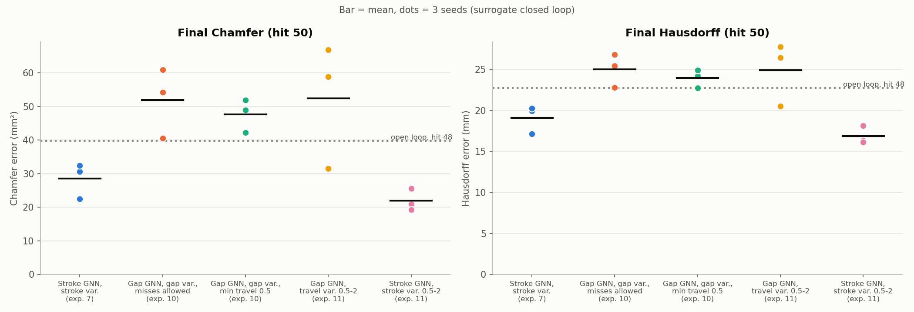
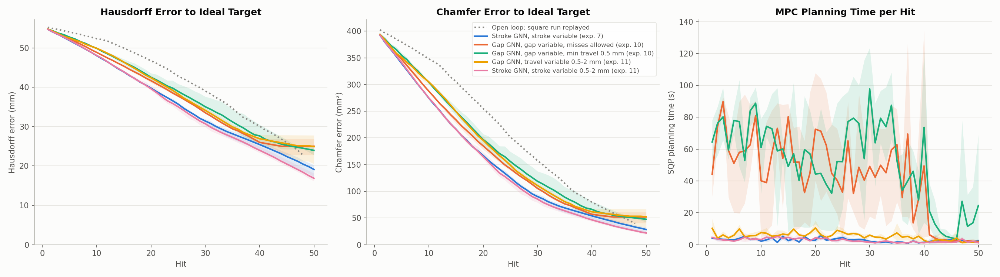
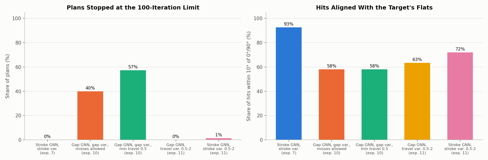
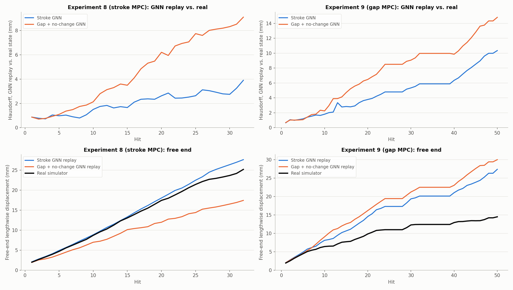

# Cost experiments 10-11: the gap control fails because the gap-trained GNN predicts real MPC hits worse, not because of misses or bugs

**Date:** 2026-09-27 · **Script:** `control/cost_design.py` (surrogate closed loop) ·
**SLURM jobs:** 3895916 (exp. 10, 6 runs), 3896099 (exp. 11, 3 runs),
3896129 (exp. 11 stroke comparison, 3 runs) ·
**Raw output:** `control/results/surrogate/e10/`, `control/results/surrogate/e11/` ·
**Configs:** `exp10_gap_min_travel.json`, `exp11_gap_gnn_travel_variable.json`,
`exp11b_stroke_gnn_min_travel.json` (this folder)

## Summary

Experiment 9 switched the MPC from a relative stroke to an absolute half-gap
and did much worse. A code review found no bug; see the experiment 9 report.
These experiments test three possible causes, one at a time, in the fast
surrogate loop. "Surrogate loop" means the GNN stands in for the simulator.
A **miss** (gap wider than the bar) leaves the bar unchanged in every run
here, as in the real simulator.

| Candidate cause | Test | Verdict |
|---|---|---|
| The MPC exploits misses | Forbid them: travel ≥ 0.5 mm (exp. 10) | **Not the main cause.** Chamfer 47.7 vs. 51.9 mm² with misses allowed. |
| The optimizer can't handle a gap variable | Keep the gap GNN; let the optimizer vary the travel instead (exp. 11) | **Not the main cause.** Plans converge (0% at the iteration limit), but Chamfer is 52.5 mm². |
| The gap-trained GNN models the process worse | Same allowed actions with the stroke GNN (exp. 11), and replay real hits through both GNNs | **This is it.** Stroke GNN: 22.0 mm². The gap GNN over-predicts stretch on the hits the MPC chooses. |

**Why the change caused this:**
- The absolute gap made the GNN a worse model of forging away from the
  training toolpaths, even though it was just as accurate on the held-out
  square run.
- The MPC seeks out exactly the hits its model is optimistic about. On
  experiment 9's real hits, the gap GNN over-predicts stretch by 0.44 mm per
  hit, against 0.20 mm for the stroke GNN.
- Replaying experiment 8's real 32 hits, the gap GNN ends 9.1 mm off the real
  bar (Hausdorff), against 3.9 mm for the stroke GNN.
- The gap variable also makes planning much harder: 40-57% of plans stopped
  at the iteration limit, and planning took 43-52 s instead of 3 s. But
  that's secondary.

## What was run

Everything matches experiments 7 and 9 except what's varied:
- **Target and cost:** the ideal 10.6 mm square target;
  J = E + 91.37·E⊥ (25% cross-section share); no stroke effort.
- **Horizon and length:** 10-hit horizon, 50 hits.
- **Seeds:** 3 per version (the optimizer's starting guess shifted randomly,
  standard deviation 2% of each control's range).
- **Station:** 17.7-75.3 mm.
- **Gap bound:** corrected to 4.96-9 mm (see experiment 9).

**Surrogate plant:** for the gap versions, each applied hit is converted
exactly as the real driver does. Travel = the current band half-thickness −
half-gap, clipped to 0-2 mm. Below 0.05 mm the hit is skipped and nothing
changes.

**Versions** (M = 3 GNNs throughout):

| Version | GNN | What the optimizer varies | Allowed travel |
|---|---|---|---|
| A. Stroke, exp. 7 | Stroke-trained | Stroke | 0-2 mm (idle hits allowed) |
| B. Gap, misses allowed (exp. 10) | Gap + no-change | Half-gap, with travel ≤ 2 mm as a constraint | 0-2 mm, misses allowed |
| C. Gap, min travel 0.5 (exp. 10) | Gap + no-change | Half-gap, with 0.5 ≤ travel ≤ 2 mm as constraints | 0.5-2 mm |
| D. Gap GNN, travel variable (exp. 11) | Gap + no-change | Travel, converted to a half-gap for the GNN | 0.5-2 mm |
| E. Stroke, 0.5-2 mm (exp. 11) | Stroke-trained | Stroke | 0.5-2 mm |

C, D and E allow exactly the same physical actions. Version A's numbers are
inflated: in the surrogate loop the stroke GNN predicts phantom stretch for
its idle hits (experiment 7 report). E removes that.

## Results

| Version | Final Chamfer (mm²) | Final Hausdorff (mm) | Free end (mm, target 56.6) | Plans at iteration limit | Hits within 10° of target flats | Planning time per hit (s) |
|---|---|---|---|---|---|---|
| A. Stroke, exp. 7 | 28.5 ± 5.3 | 19.11 ± 1.70 | 38.3 | 0% | 93% | 2.9 |
| B. Gap, misses allowed | 51.9 ± 10.4 | 25.01 ± 2.05 | 32.8 | 40% | 58% | 42.9 |
| C. Gap, min travel 0.5 | 47.7 ± 4.9 | 23.96 ± 1.09 | 33.8 | 57% | 58% | 52.2 |
| D. Gap GNN, travel variable | 52.5 ± 18.5 | 24.91 ± 3.86 | 32.7 | 0% | 63% | 5.4 |
| **E. Stroke, 0.5-2 mm** | **22.0 ± 3.3** | **16.87 ± 1.10** | **40.7** | 1% | 72% | 2.7 |

Values are the mean ± sample standard deviation over 3 seeds, at hit 50. The
open-loop square run, scored against the same target after hit 48: Chamfer
39.8 mm², Hausdorff 22.7 mm. Version B skipped 10, 6 and 0 hits in its three
runs; the others skipped none.

Every gap version (B, C, D) ends worse than the open loop on average. Both
stroke versions end better. The gap versions' seeds overlap each other, and
none reaches E.

All five track together for the first ~10 hits, then the gap versions fall
behind. Planning time, averaged over seeds, is roughly 30-100 s per hit when the
optimizer varies the gap (B, C), and 2-10 s otherwise.

The gap variable is hard to optimize. On a bar that isn't round, turning the
dies at a fixed gap changes how deep they press. Measured on real mid-run
bars (experiment 8 after hit 27, experiment 9 after hit 20), the band
half-thickness varies by 1.4-3.8 mm around the bar, changing by up to
0.09 mm per degree. Angle and gap are therefore tightly tied, and the 2 mm
travel limit becomes a constraint that depends on the predicted shape. That
explains the iteration-limit stops. But version D removes that problem and
does no better, so it isn't the main cause.

### The deciding test: how well each GNN predicts real MPC hits

**Replay.** The real hit sequences of experiments 8 and 9 are fed through
each GNN, each starting from the billet and using its own predictions (the
gap GNN gets the half-gap from its own predicted bar), and compared with the
real simulator's states.

| Real sequence | GNN | Hausdorff vs. real, hit 20 (mm) | Hausdorff vs. real, last hit (mm) | Free end at last hit: GNN / real (mm) |
|---|---|---|---|---|
| Experiment 8 (32 hits) | Stroke | 2.62 | 3.90 | 27.6 / 25.2 |
| Experiment 8 (32 hits) | Gap + no-change | 6.21 | 9.10 | 17.4 / 25.2 |
| Experiment 9 (50 hits) | Stroke | 3.78 | 10.35 | 27.4 / 14.5 |
| Experiment 9 (50 hits) | Gap + no-change | 6.48 | 14.82 | 30.0 / 14.5 |

**One hit at a time.** Each applied real hit is predicted from the
simulator's true state before it (the gap GNN gets the true applied gap).
Relative error = |predicted change − real change| / |real change|.

| Real hits of | GNN | One-hit RMSE (mm) | Relative error | Stretch error per hit (mm) | Stretch bias per hit (mm) |
|---|---|---|---|---|---|
| Experiment 8 (32) | Stroke | 0.190 | 0.51 | 0.160 | +0.063 |
| Experiment 8 (32) | Gap + no-change | 0.212 | 0.59 | 0.237 | +0.011 |
| Experiment 9 (38 applied) | Stroke | 0.277 | 0.95 | 0.203 | +0.202 |
| Experiment 9 (38 applied) | Gap + no-change | 0.348 | 1.77 | 0.445 | +0.444 |

What these show:
- **On the stroke MPC's own trajectory (experiment 8), the stroke GNN tracks
  reality closely.** The free end stays within 2.5 mm after 32 hits. The gap
  GNN drifts 2-3 times faster and under-predicts the stretch by 7.8 mm.
- **On experiment 9's trajectory, both GNNs over-predict the stretch.** The
  gap GNN is worst: +0.44 mm per hit, with a one-hit error bigger than the
  real change itself (relative error 1.77). That's the trajectory the gap MPC
  chose, because its model said those hits stretch the most. In reality they
  stretched far less (free end 14.5 mm after 50 hits).
- **On the held-out square run (seed 3), the gap GNN was as accurate as the
  stroke GNN** (GNN report `2026-09-27_gap_control`). The weakness only shows
  on trajectories unlike the training toolpaths, which is where the MPC goes.

## Why the gap-trained GNN generalizes worse (a hypothesis, not yet tested)

With a stroke input, the GNN is told directly how far each die moves in.

With a gap input, it has to work that out: compare the gap with the bar's
current thickness across the die band. That spans 10-16 mm of bar and the
whole 19 mm band. With M = 3 message-passing steps, each surface node only
exchanges information with nodes 3 edges away.

On the training toolpaths, the thickness at each station follows a
predictable schedule, so a shortcut can work there. On the MPC's
trajectories, with off-flat angles, repeated stations and bars pressed more
in one direction than the other, it doesn't. The two tests below would check
this directly.

## Conclusions

1. **The failure of the gap control is not a bug, not the miss loophole, and
   not mainly the optimizer.** Forbidding misses (C) and fixing convergence
   (D) each leave the gap versions at Chamfer ~48-53 mm².
2. **The gap-trained GNN is a worse model of the hits the MPC chooses.** It
   over-predicts stretch 2.2× more than the stroke GNN on experiment 9's real
   hits, and drifts 2-3× faster on experiment 8's real sequence. The MPC
   exploits those optimistic errors.
3. **The stroke GNN with a 0.5 mm minimum stroke (E) is the best design
   tested so far in the surrogate loop:** Chamfer 22.0 mm², Hausdorff
   16.9 mm, free end 40.7 mm, 2.7 s per plan. It also removes the idle hits
   that inflated experiment 7's surrogate numbers.

## Caveats

- **Surrogate loop:** each GNN is also its own plant, so a GNN that is
  optimistic about its own chosen hits looks better here than in reality.
  The replay and one-hit tests use the real simulator's states and don't have
  this problem, but they cover only two real trajectories (82 hits).
- 3 seeds per version. The spread is large for D (Chamfer 31.5-66.9 mm²).
- The generalization mechanism above is a hypothesis.
- Version E has not been run on the real simulator. Experiment 8's failure
  (repeated small strokes of ~0.6-1.2 mm at the clamp end) is not prevented by
  a 0.5 mm minimum.

## Possible next steps

- **Return to the stroke control, with a 0.5 mm minimum stroke (version E),
  on the real simulator:** 50 hits, experiment 8's cost. That's the current
  best candidate. A guard against repeated hits at one spot may be needed
  given experiment 8's failure.
- **If the absolute gap is still wanted as the MPC's interface:** keep the
  stroke GNN and convert the MPC's gap to a stroke using the known band
  thickness. The model stays the better one; the optimizer difficulty
  (angle-gap coupling) would remain.
- **Test the hypothesis:** retrain the gap GNN with more message-passing
  steps (e.g. M = 15) and rerun the replay test. If the replay error drops to
  the stroke GNN's level, the nonlocal-thickness explanation holds.

## Files

- `figures/errors_and_time.png`, `figures/final_errors.png`,
  `figures/optimizer_and_angles.png` and `summary.json`: made by
  `make_figures.py` from the 15 surrogate runs' `results.json`.
- `figures/replay_real_hits.png` and `replay_real_hits.json`: made by
  `replay_real_hits.py` from experiments 8 and 9's `results.json` and
  `step_*.vtu`, using both GNN checkpoints.
- `one_hit_real.json`: made by `one_hit_real.py` from the same inputs.
- The angle-gap coupling numbers (band half-thickness vs. angle on real
  mid-run bars) were measured by a one-off check during the session. They
  are quoted in the text but not written to a file here.
- `exp10_gap_min_travel.json`, `exp11_gap_gnn_travel_variable.json`,
  `exp11b_stroke_gnn_min_travel.json`: the run configurations.
