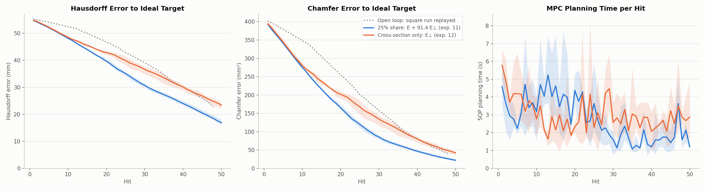
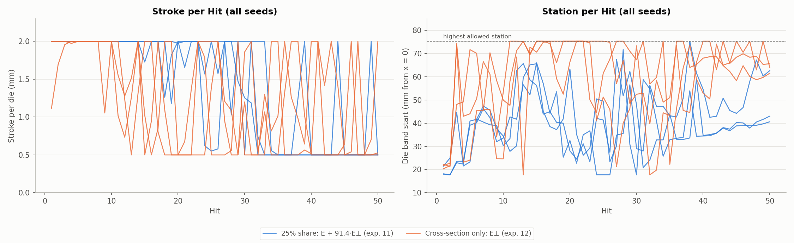
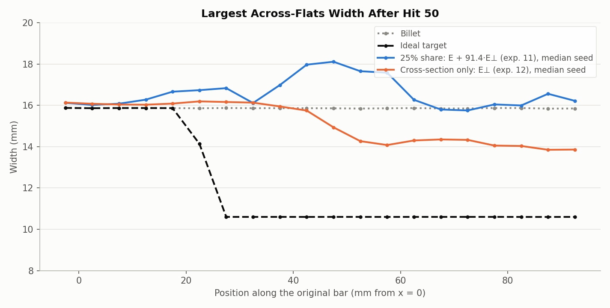

# Cost experiment 12: a cross-section-only cost squares the bar better but stretches it less, so length does not "take care of itself" in 50 hits

**Date:** 2026-09-27 · **Script:** `control/cost_design.py` (surrogate closed loop) ·
**SLURM job:** 3896225 (3 runs) · **Raw output:** `control/results/surrogate/e12/` ·
**Configs:** `exp12_cross_section_only.json` (this folder)

## Summary

The question: since the target was built by volume conservation, a bar that
reaches the target cross-section everywhere must also have the target length.
So could the cost leave length out entirely? The cost was reduced to the
cross-section error alone. Each surface node is still compared with its own
target position, but only in the cross-section directions (y, z); its
lengthwise difference is dropped. There are no weights to tune.

**Result (surrogate loop, 3 seeds, 50 hits):** compared with the 25%-share cost
under the same rules (stroke GNN, strokes 0.5-2 mm, experiment 11), the
cross-section-only cost:
- **Squares the bar better:**
  - Cross-section error 3.33 vs. 3.84 mm.
  - 95% of hits within 10° of the target's flats, against 72%.
- **Stretches it less:** the free end moved 34.8 vs. 40.7 mm (target 56.6).
- **Ends worse on Hausdorff and Chamfer,** which include length: Chamfer
  42.1 vs. 22.0 mm², Hausdorff 23.4 vs. 16.9 mm. That's slightly behind the
  open-loop square run (39.8 mm², 22.7 mm).

Length does partly follow: the bar stretched 34.8 mm with no reward for
stretching. But it doesn't follow fast enough. After the first 10 hits, the
cross-section-only MPC uses lighter strokes (about 1.0-1.2 mm vs. 1.7-1.9 mm
for hits 11-30). It also presses mostly the far end: 28% of its hits at the
highest allowed station, including 11 in a row in one run. The half of the
bar nearer the clamp stays almost untouched.

## What was run

- **Cost:** J = Σ over the 10 planned hits, Σ over surface nodes, of
  (y − y_target)² + (z − z_target)². There is no lengthwise term, no weight,
  no stroke effort and no control-change penalty.
  - Implemented as `penalty = {"lengthwise": 0}` in `control/mpc.py`.
  - Checked numerically: equal to the cross-section error E⊥ (28,841 = 28,841
    on a test plan). The default cost is unchanged.
- **Everything else as experiment 11's stroke comparison run:**
  - Stroke-trained M = 3 GNN (`GNN/mp_sweep/finetune/mp_3`).
  - Stroke 0.5-2 mm, station 17.7-75.3 mm, angle 0-360°.
  - Ideal 10.6 mm square target, 10-hit horizon, 50 hits.
  - 3 seeds, with the optimizer's starting guess shifted by 2% (standard
    deviation) of each control's range.
- **Surrogate loop:** the GNN stands in for the simulator.
- **Comparison:** experiment 11's stroke GNN with 0.5-2 mm strokes and the
  25% cross-section share cost, J = E + 91.4·E⊥.

## Results

Mean ± sample standard deviation over 3 seeds, after hit 50:

| Cost | Final Chamfer (mm²) | Final Hausdorff (mm) | Free end (mm, target 56.6) | Cross-section error (mm) | Hits within 10° of flats | Hits at the highest station (≥ 74 mm) | Planning time per hit (s) |
|---|---|---|---|---|---|---|---|
| 25% share, E + 91.4·E⊥ (exp. 11) | **22.0 ± 3.3** | **16.87 ± 1.10** | **40.7** | 3.84 | 72% | 0.7% | 2.7 |
| Cross-section only, E⊥ (exp. 12) | 42.1 ± 5.1 | 23.40 ± 1.19 | 34.8 | **3.33** | **95%** | 28% | 3.0 |

Open-loop square run after hit 48, same target: Chamfer 39.8 mm², Hausdorff
22.7 mm. Per seed, experiment 12's Chamfer was 45.5, 36.3 and 44.5 mm²; all
three are worse than every experiment 11 seed (19.3-25.6 mm²).

Cross-section error is the mean |width − target width| over both across-flats
directions, in 5 mm slices of x = 20-90 mm.

The two costs track together for about 12 hits. After that the
cross-section-only runs fall behind on both Hausdorff and Chamfer, finishing
close to the open loop. Planning time is similar, 1-6 s per hit.

Mean stroke by 10-hit block:

| Cost | Hits 1-10 | Hits 11-20 | Hits 21-30 | Hits 31-40 | Hits 41-50 |
|---|---|---|---|---|---|
| 25% share | 2.00 mm | 1.93 mm | 1.69 mm | 0.81 mm | 0.60 mm |
| Cross-section only | 1.93 mm | 1.17 mm | 1.09 mm | 1.02 mm | 0.87 mm |

The cross-section-only runs alternate full and minimum strokes from hit 10
onward. Their stations sit mostly between 60 mm and the highest allowed
station (75.3 mm).

The median seed of each is shown, with the largest across-flats width per
5 mm slice.
- **Cross-section only:** an even ~14 mm section beyond x ≈ 50 mm, and nearly
  untouched (~16 mm) between the clamp and x ≈ 40 mm.
- **25% share:** stretched further, but its sections are lopsided, bulging to
  ~18 mm in one direction around x = 40-60 mm. Its better Hausdorff and
  Chamfer come from length, not shape.

Neither is near 10.6 mm after 50 hits.

## Why length doesn't follow faster (likely explanation, not proven)

**How volume conservation links the two:** a slice gets longer only when its
cross-sectional area shrinks. That takes many hits in alternating directions.
A single hard hit also bulges the bar sideways, which temporarily makes the
cross-section error *worse* in the other direction.

**What each cost sees in a 10-hit plan:**
- **Cross-section only:** a full 2 mm stroke looks partly counter-productive,
  so it prefers lighter strokes and hits where it can improve the shape
  cheaply (mostly the far end).
- **With a length term:** every hit that stretches the bar pays off at once,
  so hard hits look worthwhile.

So the cross-section-only cost optimizes the right final goal but gives a
weak incentive, within 10 hits, to do the area reduction that produces the
stretch. This fits the lighter strokes and better squareness. It hasn't been
tested directly: a longer horizon, or a check of the planned cost of full vs.
light strokes, would test it.

## Conclusions

1. **Volume conservation doesn't make length take care of itself within 50
   hits and a 10-hit horizon.** The cross-section-only cost stretched the bar
   6 mm less, and ended at Chamfer 42.1 vs. 22.0 mm² for the 25%-share cost.
2. **It does square the bar better** (cross-section error 3.33 vs. 3.84 mm;
   95% of hits on the flats) with nothing to tune.
3. **The 25%-share cost with a 0.5-2 mm stroke (experiment 11) stays the best
   design.** Its sections are more lopsided, so it isn't better at shape.

## Caveats

- Surrogate loop only: the stroke GNN is also the plant, and it
  over-predicts stretch slightly on its own trajectories (+0.06 mm per hit on
  experiment 8's real hits). That flatters the length-rewarding cost a
  little.
- 3 seeds each. The explanation above is a hypothesis.
- Neither design comes close to the target in 50 hits (free end 35-41 of
  56.6 mm).

## Possible next steps

- Run the best design so far on the real simulator: experiment 11's stroke
  GNN, 0.5-2 mm stroke, 25%-share cost, 50 hits.
- A cost between the two: keep the cross-section term dominant but add a
  small length term. The share rule already does this; e.g. a 50% share
  under the 0.5-2 mm stroke rule could be tested in the surrogate first.
- Test the explanation with a longer horizon (e.g. 20 hits) for the
  cross-section-only cost: if its strokes stay hard and length follows, the
  horizon is the limit.

## Files

- `figures/errors_and_time.png`, `figures/controls.png`,
  `figures/width_along_bar.png` and `summary.json`: made by `make_figures.py`
  here, from the 6 runs' `results.json` and `final_state.npy` and the target
  file.
- `exp12_cross_section_only.json`: the run configurations.
