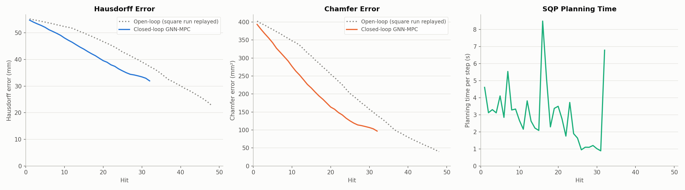
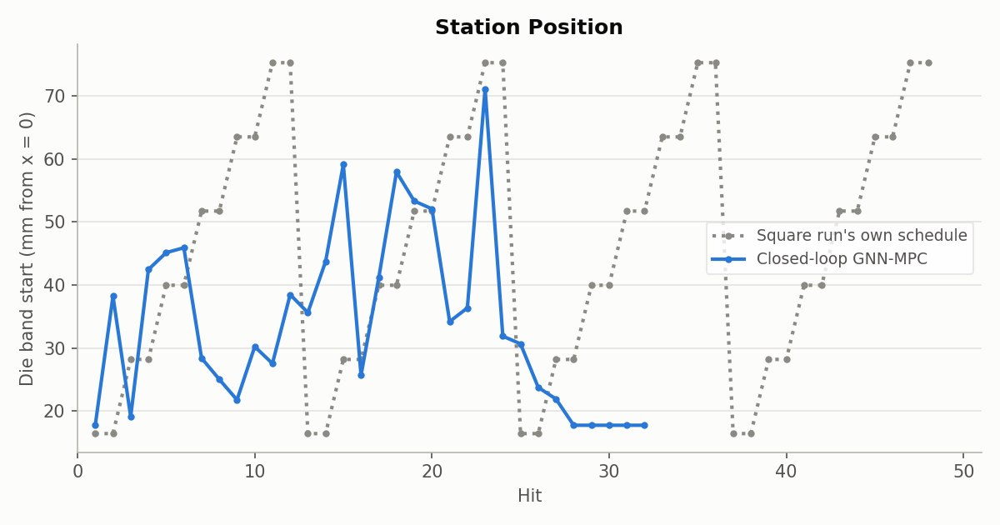
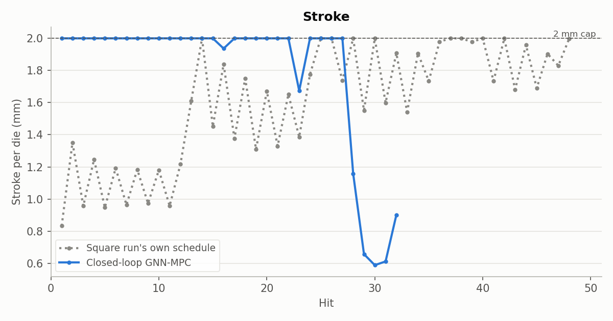
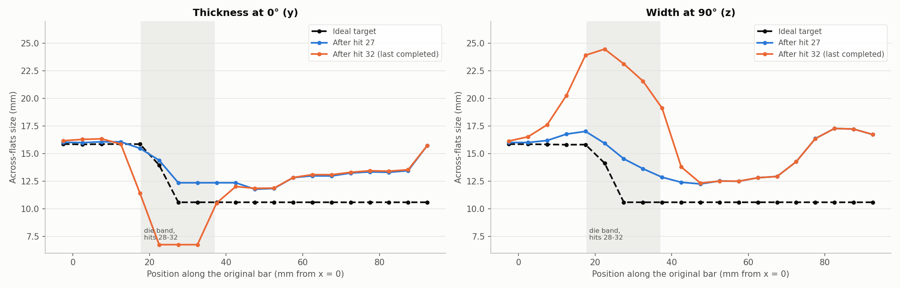

# Cost experiment 8: the 25%-share design tracks well for 27 hits on the real simulator, then flattens the clamp end until the simulator fails

**Date:** 2026-09-27 · **Script:** `control/eval_square_target.py` ·
**SLURM job:** 3889543 (3 attempts; hit 33 failed each time) ·
**Raw output:** `control/results/real_simulator/e8_ideal_share25/`

## Summary

Experiment 7's winning cost design was run on the real simulator (JAX-FORGE)
for up to 50 hits toward the ideal 10.6 × 10.6 mm square target. That design
sets the cross-section weight so the cross-section gets a 25% share of the
starting cost (w = 91.4), with no stroke effort.

**Hits 1-27 went well.**
- The MPC spread its hits over stations 17.7-71 mm and alternated 0° and 90°.
  It never pinned the clamp end the way experiment 6 did.
- Its Hausdorff and Chamfer errors beat the open-loop square run at every hit.
  After hit 27 it was at Hausdorff 34.4 mm and Chamfer 114 mm²; the open-loop
  run was at 41.4 mm and 184 mm².
- The real simulator matched the surrogate-loop prediction from experiment 7
  closely. At hit 12: Hausdorff 46.46 mm real vs. 46.45 mm surrogate.

**Hits 28-32 went badly.**
- The MPC pressed the lowest allowed station (17.7 mm) five times in a row,
  all at 0°, with small strokes of 0.6-1.2 mm.
- Each stroke is measured from the current surface, so they added up to
  3.9 mm per die. The section at x ≈ 20-35 mm was flattened into a slab 6.8 mm
  thick and 24.5 mm wide, against a target of 10.6 × 10.6 mm.
- The reheat before hit 33 then failed on the distorted mesh, three times
  (the worst element had shrunk to 51% of its volume). The run ended there.

**Cause:** the GNN mispredicts exactly these hits. For hits 29-32 it predicted
that the band would get slightly *thicker*. In reality it got 1.2-1.8 mm
thinner per hit. The GNN also over-predicted the free-end stretch on hits 28-30,
by 0.15-0.44 mm. So to the MPC these hits looked like cheap stretch that did
no harm to the cross-section. This is the same failure the experiment 7
surrogate runs showed as "idle drift", now on the real simulator. It's the
motivation for the absolute-gap input being tested in experiment 9.

## What was run

- **Plant:** JAX-FORGE thermo-mechanical simulation (`ForgingPlant`), reheated
  to the initial temperature profile before every hit.
- **Planner:** M = 3 GNN (`GNN/mp_sweep/finetune/mp_3/checkpoint.pt`),
  single-shooting SLSQP, 10-hit horizon, re-planned from the simulator's true
  state before every hit.
- **Cost:** J = E + 91.37·E⊥. E is the squared node-by-node distance to the
  target, summed over the horizon; E⊥ is the same distance counted only in the
  cross-section directions (y, z). There is no stroke effort and no
  control-change penalty (see `2026-09-26_mpc_cost_function/cost_function.pdf`).
- **Target:** `control/targets/ideal_square_10.6/target_on_billet.vtu`: round
  to the 800 °C point, a 7.5 mm taper, then a 10.6 × 10.6 mm square, 158.2 mm
  long in total.
- **Limits:**
  - Station (start of the 19.3 mm die band): 17.7-75.3 mm.
  - Angle: 0-360°.
  - Stroke: 0-2 mm per die, measured from the bar's current outermost point in
    the band.
- **Run length:** 50 hits planned, with up to 2 automatic resumes after a
  simulator failure.
- **Open-loop reference:** the square run's 48 hits, replayed and scored
  against the same ideal target.

## Results

Hausdorff is the largest distance between the bar's surface and the target's;
Chamfer is the mean squared nearest-surface distance.

| Hit | Hausdorff, MPC (mm) | Hausdorff, open loop (mm) | Chamfer, MPC (mm²) | Chamfer, open loop (mm²) |
|---|---|---|---|---|
| 1 | 54.77 | 55.23 | 393.3 | 402.5 |
| 12 | 46.46 | 51.73 | 252.3 | 335.3 |
| 20 | 39.55 | 46.69 | 163.7 | 254.7 |
| 27 | 34.42 | 41.40 | 113.9 | 184.2 |
| 32 | 31.95 | 37.36 | 96.9 | 140.2 |

The undeformed billet scores Hausdorff 56.6 mm and Chamfer 430.7 mm² against
this target.

The MPC stays ahead of the open loop at every hit. But its progress slows
visibly from hit 27, when the clamp-end hits begin. These errors are
dominated by length (the free end had moved 25.2 of the 56.6 mm needed by hit
32), so they don't show the cross-section damage.

**Computation time:**
- **MPC planning:** 3.0 s per hit on average (median 2.8 s, max 8.5 s). 31 of
  32 plans converged; hit 16's plan stopped at the 100-iteration limit.
- **Simulator:** 9.3 min per hit on average.

**Surrogate vs. real:**

| Hit | Hausdorff, surrogate (mm) | Hausdorff, real (mm) | Chamfer, surrogate (mm²) | Chamfer, real (mm²) |
|---|---|---|---|---|
| 12 | 46.45 | 46.46 | 251.1 | 252.3 |
| 20 | 39.78 | 39.55 | 167.0 | 163.7 |
| 27 | 33.82 | 34.42 | 109.1 | 113.9 |
| 32 | 30.00 | 31.95 | 80.4 | 96.9 |

The surrogate numbers are experiment 7's mean over 3 seeds. The two agree
closely until about hit 27, then separate. Two of the three surrogate seeds
also started small clamp-end hits around hits 30-32.

Stations were spread along the bar until hit 27. From hit 28 every hit sits
at the lowest allowed station.

Strokes were at or near the 2 mm cap until hit 27. For hits 28-32 they were
1.16, 0.66, 0.59, 0.61 and 0.90 mm, all at 0°.

Thickness at 0° (left) and width at 90° (right), after hit 27 and after
hit 32, with the target dashed. The shaded band is where hits 28-32 landed.
In it, the bar went from 12.4 × 14.5 mm to 6.8 × 24.5 mm at its extremes: far
thinner than the target one way and more than twice as wide the other. The
rest of the bar is unchanged.

## Why: the GNN mispredicts small repeated hits

From `gnn_check.json`: the GNN's one-hit prediction for each applied hit,
starting from the simulator's true state before the hit, compared with what
the simulator did. Band size is measured over x = 20-35 mm.

| Hit | Station (mm) | Angle | Stroke (mm) | Thickness before (mm) | GNN prediction (mm) | Simulator (mm) | Stretch, GNN (mm) | Stretch, simulator (mm) |
|---|---|---|---|---|---|---|---|---|
| 26 | 23.7 | 83° | 2.00 | 15.45 | 16.74 | 16.37 | 0.71 | 0.72 |
| 27 | 21.9 | 0° | 2.00 | 16.37 | 14.18 | 14.40 | 1.07 | 0.56 |
| 28 | 17.7 | 0° | 1.16 | 14.40 | 13.24 | 12.28 | 0.68 | 0.24 |
| 29 | 17.7 | 0° | 0.66 | 12.28 | 12.89 | 10.96 | 0.54 | 0.34 |
| 30 | 17.7 | 0° | 0.59 | 10.96 | 11.89 | 9.78 | 0.53 | 0.38 |
| 31 | 17.7 | 0° | 0.61 | 9.78 | 11.10 | 8.56 | 0.54 | 0.51 |
| 32 | 17.7 | 0° | 0.90 | 8.56 | 10.68 | 6.76 | 0.60 | 1.00 |

Thickness is along the press direction (y at 0°; for hit 26, pressed at 83°,
the column shows y). On full 2 mm hits at normal thicknesses (hits 26-27) the
GNN is close. On the small hits against an already-flattened bar (hits 29-32),
it predicts the band gets *thicker* by 0.6-2.1 mm. In reality it gets thinner
by 1.2-1.8 mm. The GNN also over-predicts stretch on hits 28-30 by 0.15-0.44 mm.

Two things likely combine here:
- **Small strokes:** they sit near the bottom of the training range
  (0.5-2 mm), on a bar shape the training data never contains.
- **Relative stroke:** a stroke measured from the current surface keeps
  cutting deeper on every repeat, and the GNN has to infer that from the
  state. It evidently hasn't learned it.

Because the GNN sees cheap stretch and no cross-section cost, the planner
keeps choosing these hits.

**Why the run ended:** the reheat step before hit 33 failed to converge on all
3 attempts, before hit 33's pressing began. The saved state's worst element
had shrunk to 51% of its original volume (min det F = 0.51; 632 of 123,184
integration points below 0.8). The resumed attempts planned practically the
same hit 33 (station 20.4-20.6 mm, angle 86-87°, stroke 2 mm). They didn't
fail on the new hit, but on reheating the damaged mesh.

## Conclusions

1. **For 27 hits the design works.** It's clearly better than the open-loop
   run, it doesn't pin the clamp end, and it matches the surrogate prediction.
2. **It fails when the MPC relies on the GNN's small-stroke predictions.**
   Repeated small strokes at one spot are predicted as harmless stretch but
   actually flatten the bar. Hausdorff and Chamfer, being dominated by length,
   hide this until the mesh breaks.
3. **This is the case the absolute-gap control (experiment 9) targets.** With
   a gap input, pressing the same spot again to the same gap does nothing,
   and the GNN is told the final thickness directly.

## Caveats

- Single run, stopped at 32 of 50 hits by a simulator failure, so it isn't
  directly comparable over 50 hits.
- The Hausdorff/Chamfer comparison with the open loop is dominated by length
  and flatters the run after hit 27. The width profile is the more telling
  measure.
- The hot bar is compared with nominal (cool) dimensions (~1.2% difference),
  neglected by decision.
- The two resumed attempts ran code edited after the run started (the new gap
  option, off by default). They used the unchanged stroke path, as their logs
  confirm ("Control input: stroke"), and all 32 recorded hits come from the
  original attempt.

## Possible next steps

- **Experiment 9 (queued, job 3891118):** same cost and target, with the GNN
  retrained on the absolute half-gap input plus no-change examples. Watch
  whether it avoids the repeated clamp-end hits.
- A guard against flattening would help any design: for example, a lower
  bound on the planned band thickness, or a check of the GNN's predicted
  thickness change.
- If the reheat failures continue, a mesh-quality stop (e.g. min det F < 0.6)
  would end a run cleanly rather than by solver failure.

## Files

- `figures/error_vs_hit.png`, `figures/controls_station.png`,
  `figures/controls_stroke.png`, `figures/controls_angle.png`: the run's own
  plots, copied from the raw output folder.
- `figures/width_along_bar.png` and `gnn_check.json` (GNN vs. simulator for
  hits 26-32, plus the final state's det F): made by `make_figures.py` here,
  from the run's `results.json`, `step_*.vtu`, `target.vtu` and
  `plant_state.npz`.
