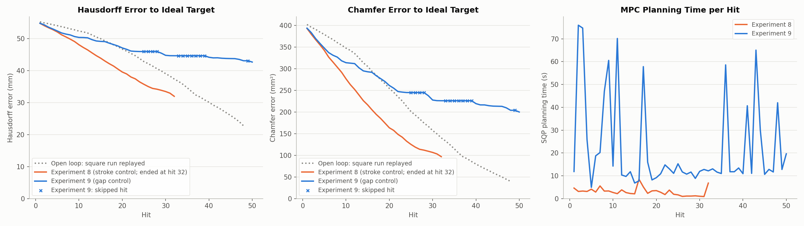
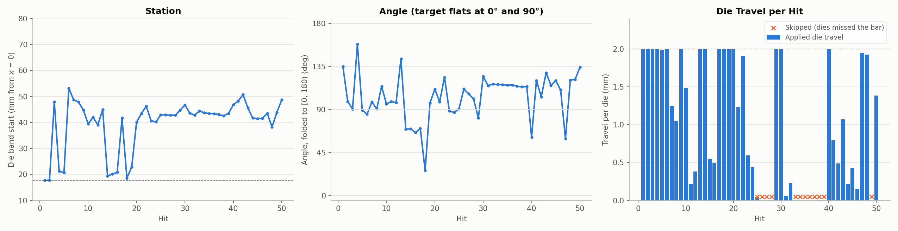
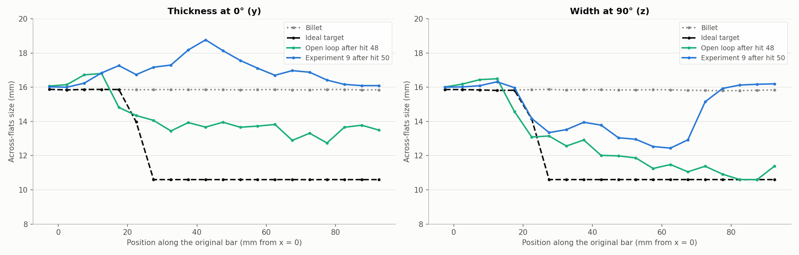
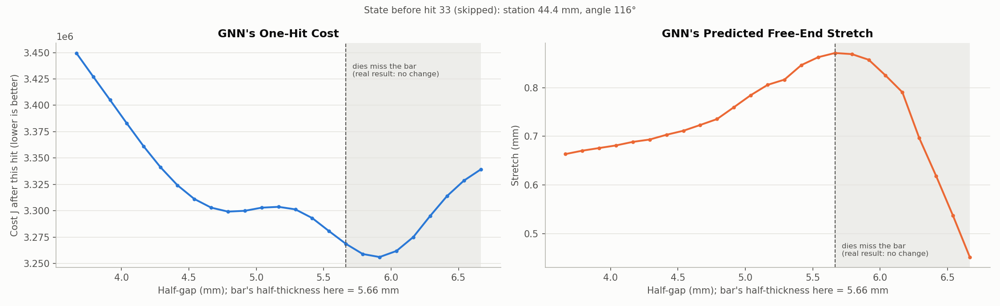

# Cost experiment 9: with the gap-control GNN the MPC stalls, choosing "misses" the GNN wrongly thinks stretch the bar

**Date:** 2026-09-27 · **Script:** `control/eval_square_target.py` (gap control) ·
**SLURM job:** 3891118 (1 attempt, all 50 hits) ·
**Raw output:** `control/results/real_simulator/e9_ideal_share25_gap/`

## Summary

Experiment 9 repeated experiment 8 with the retrained **gap + no-change** GNN
(`GNN/gap_control/gap_nochange10`; see
`GNN_reports/2026-09-27_gap_control/report.md`). The MPC now chooses the
absolute half-gap the dies close to, instead of a stroke. Cost, target,
horizon and number of hits are unchanged, and the plant is the real
simulator.

**It ran all 50 hits without a simulator failure, but it did much worse than
experiment 8 and the open loop:**

| After | Hausdorff (mm) | Chamfer (mm²) |
|---|---|---|
| Experiment 9, hit 50 | 42.7 | 200.1 |
| Open-loop square run, hit 48 | 22.7 | 39.8 |
| Experiment 8, hit 32 | 32.0 | 96.9 |
| Experiment 9, hit 32 | 44.6 | 226.2 |

The free end moved only 14.5 mm, against 35.0 mm for the open loop and 56.6 mm
for the target.

**The MPC stalled.**
- 12 of 50 hits were skipped: the chosen gap was wider than the bar, so the
  dies missed. That includes hits 33-39 in a row.
- Another 12 hits pressed less than 0.6 mm.
- 41 hits landed between 38 and 54 mm along the bar, and after hit 30 most
  were at 110-120° rather than the target's 0°/90° flats.

**Cause:** on thin sections the GNN predicts that a "miss" stretches the bar.
At the state before hit 33 (half-thickness 5.66 mm), the GNN's cheapest
option is a half-gap of 5.91 mm, where the dies miss. For that miss it
predicts 0.86 mm of free-end stretch, more than a full 2 mm hit (0.66 mm).
In reality a miss does nothing.

The no-change training examples didn't cover this. They were built from
training states whose band half-thickness is about 6.8 mm or more, so they
only taught "a gap of about 7-10 mm does nothing". A gap of 5.7-6.7 mm was
only ever seen as a real hit. This is the same phantom-stretch drift as in
experiment 7, moved to thinner bars.

## What was run

- **Plant:** JAX-FORGE (`ForgingPlant`), reheated to the initial temperature
  profile before every applied hit.
- **Planner:** the gap + no-change M = 3 GNN, single-shooting SLSQP, 10-hit
  horizon, re-planned from the simulator's true state every hit.
- **Cost:** J = E + 91.37·E⊥, with no stroke effort, as in experiment 8.
- **Target:** the ideal 10.6 × 10.6 mm square (158.2 mm).
- **Controls:**
  - Station: 17.7-75.3 mm.
  - Angle: 0-360°.
  - Half-gap: 4.25-9.0 mm.
  - Die travel per hit (band half-thickness − half-gap) at most 2 mm: an
    SLSQP constraint, using the GNN's predicted state for later hits in the
    plan.
- **Applied hit:** travel = true band half-thickness − chosen half-gap,
  clipped to 0-2 mm. Below 0.05 mm the hit is skipped with no simulation, and
  the state is unchanged.
- **Open-loop reference:** the square run replayed, scored against the same
  target.

## Results

Hausdorff is the largest distance between the bar's surface and the target's;
Chamfer is the mean squared nearest-surface distance.

Experiment 9 (blue) keeps pace with the open loop only until about hit 17,
then flattens out. The crosses are skipped hits, where the error can't change.
Experiment 8 (orange) was ahead of both until its failure at hit 33.

| Hit | Hausdorff, exp. 9 (mm) | Hausdorff, exp. 8 (mm) | Hausdorff, open loop (mm) | Chamfer, exp. 9 (mm²) | Chamfer, exp. 8 (mm²) | Chamfer, open loop (mm²) |
|---|---|---|---|---|---|---|
| 1 | 54.79 | 54.77 | 55.23 | 394.0 | 393.3 | 402.5 |
| 10 | 50.35 | 48.07 | 52.34 | 314.1 | 276.9 | 347.7 |
| 20 | 47.08 | 39.55 | 46.69 | 261.5 | 163.7 | 254.7 |
| 32 | 44.64 | 31.95 | 37.36 | 226.2 | 96.9 | 140.2 |
| 48 | 43.06 | — | 22.74 | 204.1 | — | 39.8 |
| 50 | 42.66 | — | — | 200.1 | — | — |

**Computation time:**
- **MPC planning:** 22.1 s per hit on average (median 12.5 s, max 76 s),
  against 3.0 s in experiment 8. The extra time goes on the travel
  constraint's gradients. Every plan converged.
- **Simulator:** 7.7 min per applied hit.

- **Stations:** from hit 20, hits cluster at 38-51 mm; the bar beyond about
  x = 70 mm is barely touched.
- **Angles:** only 15 of 50 hits are within 10° of the target's flat
  directions (0°/90°). From hit 30 most sit near 115°.
- **Travel:** full 2 mm bites are interleaved with near-zero ones and runs of
  skips (hits 25-28, 33-39 and 49).

After hit 50 the bar is 12.4-14 mm across at 90° over x ≈ 30-65 mm. Its 0°
extent grew to as much as 18.7 mm, because the flats formed near 115° and 25°,
so the corners point along 0°. The open loop, after 48 hits, is 10.6-14.8 mm
across along most of the bar and has stretched much further.

## Why: the GNN predicts phantom stretch for misses on thin sections

This is the state before hit 33, a skipped hit (station 44.4 mm, angle 116°,
band half-thickness 5.66 mm). For each half-gap, the plots show the GNN's
predicted cost after that one hit and its predicted free-end stretch. The
shaded region is where the dies miss the bar, so the real result is no
change.

- **The GNN's cost is lowest at a half-gap of 5.91 mm, a miss.** It predicts
  0.86 mm of stretch there. A full 2 mm hit (half-gap 3.66 mm) is predicted to
  stretch only 0.66 mm and to cost more.
- **Predicted stretch peaks right at the bar's surface.** It only falls off
  about 0.5 mm beyond it. Inside the miss region the GNN is not predicting
  "no change" at all.
- **The whole trajectory confirms it.** On the 12 skipped hits, the GNN's
  prediction was off by an RMSE of 0.32 mm on average, although nothing
  moved. That's nearly as large as its error on applied hits (0.35 mm).

**Why the no-change examples didn't fix it:** each one is a real training
state plus a half-gap 0-2 mm beyond that state's band half-thickness. In the
training data those half-thicknesses are about 6.8 mm and up (sampled: 6.77
min for the random-hit data, 6.91 for the square run). So "no change" was
only ever paired with half-gaps of about 7-10 mm. The GNN learned to key on
the gap value, not on the gap relative to the bar's current thickness. Once
the MPC had thinned sections to a half-thickness of about 5.5-6 mm, a miss
there looked to the GNN like a normal hit. The GNN report's missed-hit test
missed this because it used seed 3's own states, which are no thinner than
the training states.

**Consequences:**
1. **The plan converges on "do nothing".** The MPC sees phantom stretch with
   little cross-section cost, so it repeatedly chooses gaps just above the
   bar's thickness. The applied hit becomes a skip or a tiny press.
2. **Warm starts keep it there.** Each plan starts from the previous one
   shifted by a hit, so the plan stays in the same spot (x ≈ 43 mm, ~115°)
   for many hits.
3. **Little stretch, little reshaping:** the free end reaches 14.5 mm after 50
   hits, against 35.0 mm for the open loop.

**Mesh:** the final state's worst element is at 50% of its original volume
(min det F = 0.50; 1st percentile 0.97). It's distorted somewhere, but the
simulator did not fail.

## Conclusions

1. **Absolute gap + no-change examples, as trained, is worse than the stroke
   control on the real simulator.** Final Hausdorff 42.7 mm vs. 22.7 mm for
   the open loop, and it trails experiment 8 at every hit.
2. **The failure is the same phantom-stretch drift as experiment 7, in a new
   place.** The no-change examples removed it only for gaps above about
   6.8 mm, where the training states were.
3. **The gap input needs the GNN to compare the gap with the bar's current
   thickness.** It didn't learn to. Either give that comparison to it
   directly, or train "no change" on the thin states the MPC actually
   reaches.

## Caveats

- **Bound mistake (found in the code review after the run):** the half-gap lower bound was 4.25 mm, taken
  from bulge_head, which is not in the training set. The training minimum is 4.96 mm. Two hits (21 and 29)
  used gaps below it (4.77 and 4.89 mm). That's minor next to the stall, but the bound is now 4.96 mm.
- **Code review found no other bug:** the gap calculation matches the simulator's die placement at
  any angle, relabelled training hits end exactly at their labelled gap, the planner and driver agree on
  every applied hit's travel, and both training stages used the gap input and no-change examples as set.
  The cause is data coverage: every training hit starts from a band half-thickness of at least 6.51 mm,
  while the skipped hits started from 5.47-6.06 mm.
- Single run. The angle is a nearly flat part of the cost early on (see the
  angle discussion in this session), so a different start could wander
  differently.
- Planning is 7× slower than experiment 8, from the travel constraint.
- Skipped hits cost no simulator time and assume a real skip does nothing. No
  reheat is simulated, consistent with the GNN's no-change training.
- The hot bar is compared with nominal (cool) dimensions (~1.2%), neglected
  by decision.

## Possible next steps

- **Give the GNN the travel directly:** use travel = band half-thickness −
  half-gap, clipped at 0, as the control input (or alongside the gap). A miss
  is then exactly "travel 0", whatever the bar's thickness. This keeps the
  absolute-gap interface for the MPC and makes "no contact" explicit.
- **Draw no-change examples from thin states:** also sample no-change pairs
  from states thinned toward the target (e.g. MPC closed-loop states), not
  only from training states.
- **Restrict or penalize the angle** to the target's flats (0°/90°) for
  square targets, as discussed.
- **Before another 8-hour real run, check a candidate model** with the gap
  scan above on states from experiments 8 and 9.

## Files

- `figures/errors_and_time.png`, `figures/controls.png`,
  `figures/gap_scan.png`, `figures/width_along_bar.png` and `summary.json`:
  made by `make_figures.py` here. Its inputs are the run's `results.json`,
  `step_*.vtu`, `target.vtu` and `plant_state.npz`, experiment 8's
  `results.json`, the square run's final state, and the gap + no-change
  checkpoint.
- The run's own plots (`error_vs_hit.png`, `controls_*.png`) remain in the raw
  output folder. They're superseded here by `errors_and_time.png` and
  `controls.png`, which add experiment 8 and mark the skipped hits.
