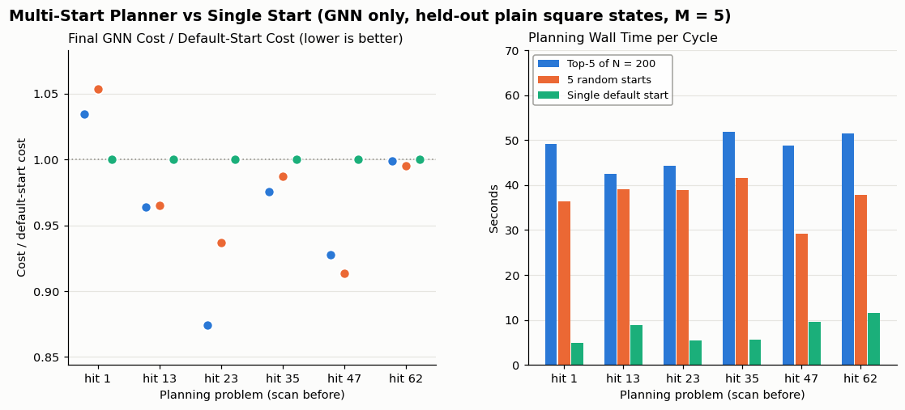

# Multi-start planner: about 4% lower GNN-predicted cost for about 6× the planning time; screening adds little over random starts

2026-10-08 · code: `control/mpc_coil.py` (`Planner`), `control/ablation_multistart.py` · SLURM jobs 3990296 (reported,
deterministic) and 3990220 (first pass, before deterministic mode) · raw output: `control/results/ablation_multistart/`
(first pass: `control/results/ablation_multistart_nondeterministic/`) · MPC run with the new planner queued: job 3990381

## Summary

The MPC plans one coil cycle (6 hits) at a time. Until now it ran one gradient-based solve, SLSQP, from one starting
plan that copies the training data's pattern. This report adds the planner of RoboCraft (Shi et al., RSS 2022,
Sec. III-E.2):

1. **Random shooting:** draw N random plans and score them with the GNN.
2. **Selection:** keep the K best.
3. **Refinement:** run the existing SLSQP solve from each of the K independently.
4. **Output:** keep the best refined plan.

Screening is batched on the GPU, with no per-sample loop. N and K are real parameters (defaults N = 100, K = 5).

All correctness checks pass:

- Batched screening gives the same inputs and cost as one plan at a time.
- With N = K = 1 the new code returns exactly the previous single-start plan.
- The same seed gives exactly the same plan. This needed PyTorch's deterministic GPU mode, which costs about 20% in
  speed.
- Gradients are finite and non-zero.

On 6 planning problems from the held-out plain square run, judged by the GNN only:

- Top-5 of N = 200 lowered the final predicted cost by **3.8% on average** against the single default start. It won
  in 5 of 6 problems.
- Refining 5 purely random starts did nearly as well: **2.5%**, also 5 of 6.
- Planning took **48 s** for top-5 and **37 s** for random starts, against **7.6 s** for the single start. That is
  small next to the roughly 45 minutes the simulator spends on each cycle's 6 hits.

**These are GNN-predicted costs, not simulator results.** The previous MPC run failed because plans exploited GNN
error, and a wider search can find such errors more easily. Whether the gain is real will show in the MPC run on the
simulator (job 3990381), which uses this planner.

## What was asked, and how it was adapted

The task was written for a generic GNN-MPC with L-BFGS refinement. Step 0 inspected the code without changing
anything. The differences were then settled with the user:

| Task assumption | This codebase | Decision |
|---|---|---|
| Refine with the existing L-BFGS | The planner uses **SLSQP** (scipy); no L-BFGS anywhere | Refine with the existing SLSQP, settings unchanged, one independent run per start, run one after another |
| H ≈ 5 hits × 3 controls | **6 hits** (one coil cycle) × [die centre mm, angle °, stroke mm] | Unchanged (locked) |
| Screen by the terminal shape cost | The cost sums the cross-section error over **all 6 forecast shapes** | Screen by the existing cost, so screening ranks by exactly what SLSQP minimizes |
| Box-bounded actions | Box bounds plus a ±11 mm coil-zone constraint (die centres near the coil) | **Coil-zone constraint removed** (user's decision); samples are uniform in the box |
| Held-out set of targets | One target (ideal 10.6 mm square) | Same target; 6 held-out *starting states* instead |
| Check plans on the simulator | – | GNN only for this comparison (user's decision); the MPC run tests the simulator |

Locked and unchanged:

- the GNN: `GNN/coil_T_sweep_test_square/mp_5/stage3.pt`, **M = 5 message-passing steps**, temperature in the
  state, plain square held out of training;
- the cost function;
- the bounds: die centre 31.58 mm to (free end − 9.35 mm), angle 0–180°, stroke 0.5–2 mm;
- the horizon, 6 hits;
- the SLSQP settings: maximum 100 iterations, scipy's default tolerance, cost divided by its value at the start.

## What was built

- **Stage A, screening:**
    - Draws N plans uniformly in the bounds with a seeded generator. The seed is the run seed plus the cycle number, so
      each cycle gets different samples but every run is repeatable.
    - Rolls them out through the GNN in batches of B = 50, with gradients off (asserted).
    - The batch shares the fixed surface graph, so it is a leading batch dimension rather than a per-sample loop.
    - The die-push inputs are computed for the whole batch at once. A new function, `node_features_batch`, mirrors the
      GNN's own `node_features` exactly (check 1 below).
- **Stage B, selection:** the K lowest screening costs, sorted.
- **Stage C, refinement:** the existing SLSQP solve from each start. Each run has its own optimizer state; the K
  costs are never summed into one problem.
- **Stage D, output:** the refined plan with the lowest GNN cost, plus diagnostics saved in the run's manifest:
    - all N screening costs and the K chosen indices;
    - per start: initial and final cost, iterations, function evaluations, termination message, starting-gradient
      norm, and how many variables end on a bound;
    - the time of each stage.
- **Options** (`mpc_coil.py`):
    - `--n-samples` (100), `--top-k` (5), `--sample-batch` (50), `--seed` (0);
    - `--sample-train-range`, off: samples only inside the training data's action ranges. These ranges are always
      printed: die centre 30.6–159.5 mm, angle −5.0 to 95.0°, stroke 0.12–2.0 mm;
    - `--include-warm-start`, off: the previous cycle's plan replaces the worst of the K.
    - `--n-samples 1` gives back the old single default start.
- **Repeatability:** PyTorch's deterministic GPU algorithms are switched on in `mpc_coil.py`. Without them, the
  GPU's sums differ in the last digits from run to run (screening costs by up to 0.008), and SLSQP amplified that
  into plans differing by up to 89 in one control value.
- The full 6-hit plan is still applied before the next scan; the planner itself has no receding horizon.

## Checks

From `results.json`, `checks`:

| Check | Result | Pass |
|---|---|---|
| Batched vs one-at-a-time GNN inputs (8 random plans) | max difference 0.0 | yes |
| Batched vs one-at-a-time cost | max relative difference 1.8e-7 | yes |
| N = K = 1 vs a copy of the previous single-start solve | final cost 40,431.0 vs 40,431.0; plans identical (difference 0.0) | yes |
| Same seed twice (N = 100, K = 5) | same 5 starts selected; plans identical; screening costs identical | yes |
| Gradients at every refinement start (90 solves) | all finite; smallest norm 4,992 (cost units per unit of the rescaled controls) | yes |
| Screening without gradients | asserted inside `Planner._screen`; ran without error | yes |

In the first pass, before deterministic mode (job 3990220):

- **Equivalence:** the costs agreed to 0.014%, but the plans differed by up to 4.7.
- **Determinism:** the same 5 starts were selected, but the plans differed by up to 89.

Those two failures are why deterministic mode is now on.

## Results

**Planning problems:** the scan (shape and measured surface temperature) at 6 cycle starts of the plain square
5-pass run, before hits 1, 13, 23, 35, 47 and 62. That run is held out of the GNN's training. Each problem plans the
next 6 hits toward the ideal square.

**Methods:**

- (a) **Top-5 of N = 200** (the task's ablation used 200; the MPC default is 100);
- (b) **5 random starts**: refine 5 uniform random plans with no screening;
- (c) **Single default start**: the previous planner.

**Cost:** the existing cost, the summed squared cross-section (y, z) distance of all surface nodes to the target
over the 6 forecast shapes, as predicted by the GNN. Lower is better.

| Planning problem | Top-5 of 200 | 5 random starts | Default start | Top-5 / default |
|---|---|---|---|---|
| before hit 1 (fresh billet) | 79,901 | 81,349 | **77,228** | 1.035 |
| before hit 13 | **49,620** | 49,672 | 51,480 | 0.964 |
| before hit 23 | **35,335** | 37,880 | 40,431 | 0.874 |
| before hit 35 | **23,448** | 23,733 | 24,042 | 0.975 |
| before hit 47 | 19,288 | **18,989** | 20,793 | 0.928 |
| before hit 62 | 13,333 | **13,279** | 13,344 | 0.999 |
| **Mean, relative to default** | **0.962** | **0.975** | 1.000 | |
| Wins against default | 5 of 6 | 5 of 6 | – | |

**Left:** every multi-start result is below the default start's cost (the dotted line at 1.0) except on the fresh
billet, where both multi-start methods are 3.5–5.3% worse. **Right:** planning time is 3–10 times longer with
multi-start. Screening (top-5) adds about 11 s on average over 5 random starts: about 6 s of screening, and the rest
because its solves ran longer (91 against 80 function evaluations on average).

### Timing

GPU: L40S, deterministic mode.

| | Top-5 of N = 200 | 5 random starts | Default start |
|---|---|---|---|
| Planning time per cycle: mean / median / max | 48.1 / 49.0 / 51.9 s | 37.2 / 38.4 / 41.7 s | 7.6 / 7.2 / 11.5 s |
| Stage A, screening 200 plans | 5.7 s (0.029 s per plan) | – | – |
| Stage B, selection | 0.0001 s | – | – |
| Stage C, refinement of all starts | 42.3 s | 37.2 s | 7.6 s |
| Function evaluations per SLSQP solve: mean (min–max) | 91.4 (40–183) | 79.6 (42–122) | 80.8 (55–122) |
| SLSQP iterations per solve (mean) | 37.1 | 35.9 | 34.5 |
| Solves ending "Optimization terminated successfully" | 30 of 30 | 30 of 30 | 6 of 6 |

One GNN forward rollout (reheat plus 6 hits) takes **0.039 s** on its own, and **0.029 s per plan** in a batch of 50.
Batching saves only about 25%, because one graph of 4,355 nodes and 26,118 edges already keeps the GPU busy. Each
SLSQP function evaluation is a rollout plus its gradient. Over a whole run of up to 20 cycles, multi-start adds about
14 minutes of planning, against about 15–20 hours of simulation.

## Why the gains are small, and why screening barely beats random starts

- **Refinement does most of the work.** SLSQP lowers the chosen start's cost by 8–16%. By contrast, the 5 best of
  200 random plans differ from each other by only 0.8–5.5% before refinement.
- **The screening rank doesn't predict the refined rank.** The best refined plan came from the best-screened sample
  in only 1 of 6 problems (before hit 23); otherwise from the 2nd or 3rd. So top-5 is mostly 5 good-enough random
  starts, which is why it is only 1.3 points better than plain random starts.
- **The default start is a strong start.** Before hits 1 and 13, the data-pattern plan's starting cost (82,071 and
  54,385) was lower than the best of 200 random plans (86,651 and 56,330). Random plans in an 18-number box rarely
  beat a hand-made plan, and the default start wins outright on the fresh billet.
- **Bounds and angles:**
    - Of the top-5 refinement solves, 25 of 30 end with at least one variable on a bound. In the 36 planned top-5 hits,
      that is mostly the 2 mm stroke cap (8 hits) and the 0°/180° angle edges (3 hits).
    - Only 2 of the 36 planned top-5 hits are more than 10° away from 0°, 90° or 180°, the same as for the default
      start. So in these problems, multi-start did not reach for off-axis angles the GNN hasn't seen.

## Caveats

- **GNN-predicted cost only.** The gains are in what the GNN predicts. The last MPC run lost to the scheduled run
  because its plans exploited GNN error (predicted cost −39,600 over 10 cycles, actual +11,400). These 6 problems
  can't show whether multi-start makes that better or worse; the MPC run on the simulator will.
- **6 problems, one run, one seed.** The 6 states all come from the plain square run, and the sampling used one
  seed. The first pass (without deterministic mode, so different screening draws) gave the same picture: top-5 at
  0.958 and random starts at 0.978 of the default cost.
- **The coil-zone constraint is gone** in all three methods, so the default start here isn't exactly the planner of
  the last MPC run, which had the constraint.
- Deterministic GPU mode makes every planning call about 20% slower; first pass against reported run: default start
  4.4 s vs 7.6 s, top-5 35.7 s vs 48.1 s.

## Possible next steps

1. Report the MPC run with this planner (job 3990381; GIFs follow automatically as job 3990382): Hausdorff and
   Chamfer error to the target and planning and simulator time per hit, against the scheduled 5-pass run and the
   previous MPC run.
2. Always add the data-pattern plan as one of the K starts. It is the best start on fresh and early bars, and costs
   one more solve.
3. If the MPC run again exploits GNN error, use the existing `--sample-train-range` option and limit SLSQP to the
   training data's ranges as well.

## Files

| File | What it is |
|---|---|
| `report.md` | this report |
| `figures/comparison.png` | copied from `control/results/ablation_multistart/comparison.png`, made by `control/ablation_multistart.py` (`--plot-only` redraws it from `results.json`) |
| `results.json` | copy of the run's results: checks, timing, per-problem costs, every start, the plans |
| `report.pdf` | this report as a PDF, made by `make_pdf.py` (needs `pip install markdown`) |

Code: `control/mpc_coil.py` (`Planner`, `node_features_batch`, `forecast_cost_batch`, `training_action_ranges`),
`control/ablation_multistart.py`, `slurm_scripts/submit_ablation_multistart.sh`.
